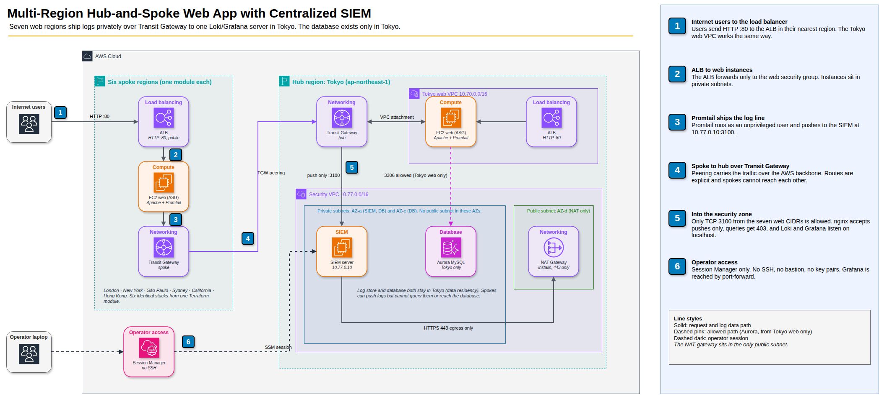
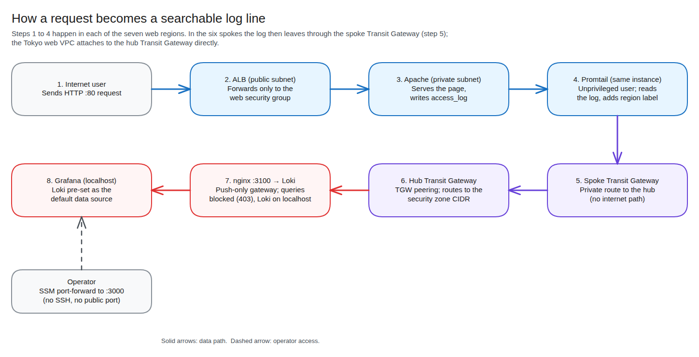
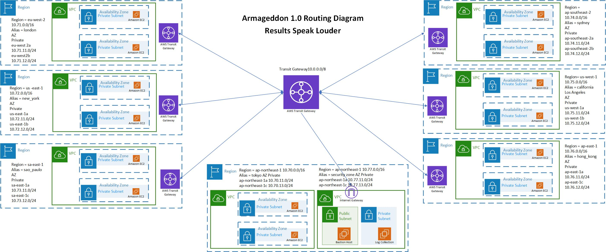
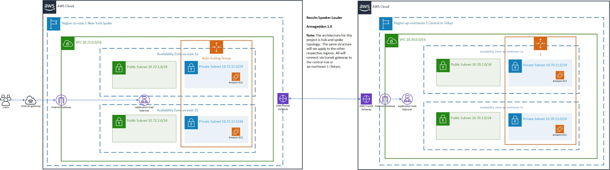

# Multi-Region Hub-and-Spoke Web Application with Centralized SIEM


Terraform for a seven-region AWS web application with a Transit Gateway hub-and-spoke network and a central log-collection stack (Promtail, Loki, Grafana) and a Tokyo-only Aurora database in a dedicated security zone. Rebuilt from an instructor-led lab into a modular, security-hardened design.

> **Scope:** This is a portfolio lab, not a production deployment. It uses plain HTTP on the load balancers, one NAT gateway per VPC and local-disk Loki storage. See [Known limitations](#known-limitations).

## At a glance

| | |
| --- | --- |
| **Problem** | Web workloads in seven regions need their logs collected in one place, without exposing the log server to the internet. |
| **Solution** | Every region runs the same web stack. Transit Gateways carry Promtail log traffic privately to a Loki/Grafana server in a Tokyo security zone. |
| **Infrastructure** | 7 web VPCs, 1 security VPC, 7 Transit Gateways, 7 load balancers, 14 web instances, 1 SIEM server, 1 Aurora MySQL cluster (Tokyo only) |
| **Code** | About 1,100 lines of Terraform. The six spoke regions share one module and are each created by a short module call. |
| **Access model** | AWS Systems Manager Session Manager only: no SSH, no bastion, no key pairs |
| **Deploy time** | About 15 minutes (13m30s measured; peering attachments are the slow part) |
| **Data residency** | The log store and the database exist only in Tokyo. Spokes can push logs but cannot query them or reach the database. |
| **Cost while running** | Roughly $1.60 to $2.60 per hour. The one-day test run (deploy, capture evidence, destroy) cost about $4.22. |
| **Skills shown** | Terraform modules and provider aliases, Transit Gateway routing, least-privilege network design, IMDSv2, centralized logging, supply-chain checks |

## Interview talk track

**Recruiter or hiring manager (30 seconds)**
"I took an instructor-led multi-region lab and rebuilt it as a modular Terraform project. Six copy-pasted region files became one module, and I found and fixed several problems, including a routing gap that would have stopped logs from ever reaching the SIEM. It collects web logs from seven regions into one Grafana instance, and the log server has no public exposure."

**Security engineer or CISO**
"The design assumes nothing should be reachable that doesn't need to be. There's no SSH: operators use Session Manager, and Grafana listens on localhost only. Loki sits behind a push-only gateway, so a compromised web server can write logs but never read them, and only the seven web VPC CIDRs can reach it. The SIEM and the database live in Availability Zones with no public subnet, and the database is Tokyo-only, so the data never leaves its region. Instances require IMDSv2 and encrypted volumes, log agents run as unprivileged users, and the software downloads are checksum-verified. Spokes can reach the hub but not each other, and every Transit Gateway route is explicit."

**Cloud or platform engineer**
"Six copy-pasted region files became one module that's called once per region, with provider aliases handling the seven regions and a nested web-stack module for the VPC, load balancer and Auto Scaling group. Adding a region is one short module call. Versions and checksums are pinned, state is remote with locking, and `terraform plan` output is part of the evidence. The stack deploys in about 20 minutes and tears down cleanly."

## Contents

1. [Architecture](#architecture)
2. [Security decisions](#security-decisions)
3. [Quick start](#quick-start)
4. [Validate it works](#validate-it-works)
5. [Evidence](#evidence)
6. [Cost and teardown](#cost-and-teardown)
7. [Troubleshooting](#troubleshooting)
8. [What I changed from the original lab](#what-i-changed-from-the-original-lab)
9. [Known limitations](#known-limitations)
10. [Future enhancements](#future-enhancements)
11. [Lessons learned](#lessons-learned)
12. [References](#references)
13. [Author](#author)

## Architecture



<sub>Editable source: [`diagrams/siem-architecture-aws.drawio`](diagrams/siem-architecture-aws.drawio). Open it in [draw.io](https://app.diagrams.net). Built with the official AWS architecture icons.</sub>

Each web VPC contains two public subnets (ALB, NAT gateway), two private subnets (Auto Scaling group of Apache instances) and its own internet gateway. Web instances run Promtail and push logs to Loki over the Transit Gateway mesh.

### Address plan

| VPC | Region | CIDR |
| --- | --- | --- |
| Tokyo web (hub) | ap-northeast-1 | 10.70.0.0/16 |
| London | eu-west-2 | 10.71.0.0/16 |
| New York | us-east-1 | 10.72.0.0/16 |
| São Paulo | sa-east-1 | 10.73.0.0/16 |
| Sydney | ap-southeast-2 | 10.74.0.0/16 |
| California | us-west-1 | 10.75.0.0/16 |
| Hong Kong | ap-east-1 | 10.76.0.0/16 |
| Security zone | ap-northeast-1 | 10.77.0.0/16 |

### Routing model

- Each spoke has its own TGW, peered to the hub TGW. Spokes can reach the Tokyo web VPC and the security zone. They **cannot** reach each other, because no spoke route table has a route to another spoke.
- The hub TGW has one route table. Its routes point to each spoke's peering attachment, the Tokyo web VPC and the security zone.
- Default route-table association and propagation are disabled on every TGW, so every route is declared in code.

### How the logs travel



<sub>Editable source: [`diagrams/siem-log-flow.excalidraw`](diagrams/siem-log-flow.excalidraw)</sub>

1. A user request reaches a regional ALB and is forwarded to an Apache instance in a private subnet.
2. Apache writes an access log line. Promtail, running on the same instance, reads it.
3. Promtail pushes the line to Loki at `10.77.0.10:3100`. The packet leaves the spoke VPC through its Transit Gateway, crosses the peering to the hub Transit Gateway, and enters the security zone.
4. Loki stores the line. Grafana, which is pre-configured with Loki as its data source, lets you query it.
5. You reach Grafana only through an SSM port-forward from your laptop.

## Security decisions

| Area | Decision | Why |
| --- | --- | --- |
| Operator access | AWS Systems Manager Session Manager. There is no bastion, no SSH rule and no key pair. | Removes an internet-facing SSH surface. Access is authenticated by IAM and logged by AWS. |
| Grafana | Bound to `127.0.0.1` and reached through an SSM port-forward | No inbound rule for port 3000 is needed. |
| Loki ingest | Security group allows TCP 3100 only from the seven web VPC CIDRs | The original lab allowed `0.0.0.0/0`. |
| Push-only gateway | nginx on :3100 allows only `POST /loki/api/v1/push` and `GET /ready`. Loki itself listens on `127.0.0.1:3101`. | Loki serves queries on the same port as ingestion, so without this any web server could read every region's logs. |
| No public subnet near data | The SIEM and Aurora are in AZs that have no public subnet. The only public subnet (NAT gateway) is in a third AZ. Terraform `precondition` checks fail the plan if this changes. | Isolation is enforced by the network layout and by a guard rail, not just by a security group. |
| Data residency | Aurora MySQL exists only in Tokyo. Its security group allows 3306 only from the Tokyo web VPC, and its route table has no internet route. Spokes have no route to it. | Shows how regional data-residency rules are met in a multi-region design. |
| Database credentials | Aurora manages the master password in Secrets Manager; storage is encrypted | No password in code or state output. |
| Self-recovery | A CloudWatch alarm on `StatusCheckFailed_System` triggers EC2 auto-recovery of the SIEM server | A hardware failure moves the instance to new hardware, keeping its ID and IP. |
| Web tier access | Web instances get the SSM managed policy through one shared instance profile | Operators can inspect any web instance without SSH. |
| SIEM egress | HTTPS (443) only | Limits what the instance can reach. |
| Instance metadata | IMDSv2 required, hop limit 1 | Reduces the impact of SSRF against the metadata service. |
| Storage | Encrypted gp3 root volumes | Encryption at rest. |
| Log agents | Promtail and Loki run as dedicated system users. Promtail gets only `CAP_DAC_READ_SEARCH` to read root-owned logs. | No agent runs as root. |
| Supply chain | Loki/Promtail version pinned; SHA-256 verified before install | Stops a tampered or swapped download from being installed. |
| IAM | AWS-managed `AmazonSSMManagedInstanceCore` only | Replaces a hand-written policy that used `Resource = "*"`. |
| Default security groups | Explicitly emptied in every VPC | Nothing can rely on the permissive default. |
| ALB | Only accepts HTTP from the internet and only forwards to the web security group; drops invalid headers | Narrow blast radius. |

### Why the data stays in Tokyo

This lab is designed around a scenario where the workload could hold health-related personal information about people in Japan. It holds no real patient data.

- **Japan's privacy law.** The Act on the Protection of Personal Information (APPI) treats medical history as "special care-required personal information". Collecting it generally needs the person's prior opt-in consent, and the law adds requirements when personal data is transferred to a third party abroad.
- **Medical-sector guidance.** Medical institutions that place medical information with a cloud provider are expected to review their risk management against the "2G3M" guidelines (Two Guidelines from Three Ministries): the Ministry of Health, Labour and Welfare's guideline for the security management of medical information systems, and the Ministry of Economy, Trade and Industry's safety management guideline for service providers that handle medical information.
- **What the design does about it.** The log store and the Aurora database exist only in Tokyo, and no other region has a route to them or a way to query them. That gives a clear, checkable data-location boundary (see `terraform output isolation_proof` and evidence `04`).
- **What it does not do.** This is a design choice, not a compliance certification. Meeting these requirements also depends on consent handling, contracts, key management and organizational controls that Terraform cannot provide. I did not find a blanket in-country storage rule in the sources listed under [References](#references), so treat Tokyo-only storage as a conservative design choice.

## Quick start

<details>
<summary><b>Prerequisites</b></summary>

- Terraform 1.10 or newer (needed for S3-native state locking) and the AWS provider 6.x (pinned by the lock file)
- AWS credentials that can create VPC, EC2, ELB, IAM and Transit Gateway resources in all seven regions
- **Hong Kong (`ap-east-1`) enabled** in your AWS account. It is an opt-in region.
- AWS CLI and the [Session Manager plugin](https://docs.aws.amazon.com/systems-manager/latest/userguide/session-manager-working-with-install-plugin.html)

</details>

```bash
cd terraform
terraform init
terraform validate
terraform plan -out tfplan
terraform apply tfplan
```

Optional remote state: copy `backend.tf.example` to `backend.tf` (git-ignored) and edit the bucket name before `terraform init`.

## Validate it works

1. **Web tiers:** open each ALB address. The page shows the region and availability zone that served it.

   ```bash
   terraform output web_endpoints
   ```

2. **Grafana:** open a tunnel through Session Manager, then browse to `http://localhost:3000` (default login `admin` / `admin`, and you are forced to change it).

   ```bash
   terraform output -raw grafana_port_forward_command   # run the command it prints
   ```

3. **Logs from every region:** in Grafana, go to **Explore**, choose the **Loki** data source and run:

   ```logql
   {job="httpd"}
   ```

   ALB health-check requests should appear from all seven regions, each with a `region` label.

4. **Isolation proof:** these outputs are computed from the deployed resources.

   ```bash
   terraform output isolation_proof      # subnet/AZ layout and boolean checks (all should be false)
   terraform output siem_inbound_rules   # only tcp/3100 from the seven web CIDRs
   terraform output database_inbound_rules
   ```

5. **Negative test:** start a Session Manager session on any web instance, then confirm it can write logs but cannot read them.

   ```bash
   curl -s -o /dev/null -w "%{http_code}\n" http://10.77.0.10:3100/ready                       # 200
   curl -s -o /dev/null -w "%{http_code}\n" "http://10.77.0.10:3100/loki/api/v1/labels"        # 403 (queries blocked)
   ```

## Evidence

| Check | Status | Where |
| --- | --- | --- |
| `terraform fmt` | Passed | Verified during development |
| HCL syntax and internal references | Passed | Script-based check |
| Bootstrap scripts (`bash -n`) | Passed | Verified during development |
| `terraform plan` (344 resources to add, 0 to change, 0 to destroy) | Passed | [`01`](evidence/screenshots/01-plan-summary-344-to-add.png), [`02`](evidence/screenshots/02-plan-outputs-subnet-layout.png), [`03`](evidence/screenshots/03-plan-outputs-and-approval-prompt.png), [text summary](evidence/command-output/01-terraform-plan-summary.txt) |
| `terraform apply` (344 added, 0 changed, 0 destroyed, 13m30s) | Passed | [`04`](evidence/screenshots/04-apply-complete-isolation-proof.png), [`05`](evidence/screenshots/05-apply-outputs-endpoints.png) |
| Isolation outputs (`terraform output isolation_proof`): all five checks `false` | Passed | [`04-apply-complete-isolation-proof.png`](evidence/screenshots/04-apply-complete-isolation-proof.png) |
| Negative test: from a Tokyo web instance over Session Manager, Loki `/ready` returns 200 and the query API returns 403 | Passed | [`08-negative-test-web-instance.png`](evidence/screenshots/08-negative-test-web-instance.png) |
| Deployed in AWS: each regional ALB serves a page showing its own region | Passed | [Sydney](evidence/screenshots/07-alb-sydney-region.png), [Tokyo](evidence/screenshots/07-alb-tokyo-region.png), [California](evidence/screenshots/07-alb-california-region.png), [London](evidence/screenshots/07-alb-london-region.png), [São Paulo](evidence/screenshots/07-alb-sao-paulo-region.png), [Hong Kong](evidence/screenshots/07-alb-hong-kong-region.png), [New York](evidence/screenshots/07-alb-new-york-region.png) |
| Deployed in AWS: Grafana showing logs from all seven regions | Passed | [`06-grafana-logs-all-seven-regions.png`](evidence/screenshots/06-grafana-logs-all-seven-regions.png) |
| Deployed in AWS: log count per region (`sum by (region) (count_over_time(...))`) shows one series for each of the seven regions | Passed | [`09-grafana-count-by-region.png`](evidence/screenshots/09-grafana-count-by-region.png) |
| Teardown: destroy plan removes all 344 resources | Passed | [`10-destroy-plan-344-to-destroy.png`](evidence/screenshots/10-destroy-plan-344-to-destroy.png) |
| Teardown: `Destroy complete! Resources: 344 destroyed.` | Passed | [`11-destroy-complete-344-destroyed.png`](evidence/screenshots/11-destroy-complete-344-destroyed.png) |
| Teardown: `scripts/verify-teardown.sh` finds no billable resources in any of the seven regions | Passed | [`12-verify-teardown-clean.png`](evidence/screenshots/12-verify-teardown-clean.png) |
| Cost: AWS Cost Explorer, daily view for the run day (2026-09-28), total $4.22 | Passed | [`13-cost-explorer-sep-28-total.png`](evidence/screenshots/13-cost-explorer-sep-28-total.png) |

## Cost and teardown

This stack creates 8 NAT gateways, 7 Application Load Balancers, 14 web instances, a SIEM instance, one Aurora instance and 14 Transit Gateway attachments (8 VPC attachments and 6 cross-region peerings). As a rough estimate, expect **$1.60 to $2.60 per hour** (about $40 to $65 per day) plus data transfer. Check current prices with the AWS Pricing Calculator. **Deploy for a short test, capture your evidence, then destroy.**

```bash
cd terraform
terraform destroy
```

Afterwards, confirm that nothing billable is left behind. The helper script checks all seven regions for NAT gateways, Elastic IPs, load balancers, Transit Gateways, EC2 instances and Aurora clusters:

```bash
./scripts/verify-teardown.sh
```

Every count should be `0`, and the script ends with `CLEAN: no billable resources found in any of the 7 regions.` If anything remains, it prints `NOT CLEAN`, lists the resource and exits with code 1. Hong Kong (`ap-east-1`) is an opt-in region, so the script reports an error there if the account has not enabled it.

## Troubleshooting

| Symptom | Likely cause | What to do |
| --- | --- | --- |
| `terraform apply` fails only for Hong Kong | `ap-east-1` is an opt-in region | Enable it in the AWS account settings, wait a few minutes, re-run |
| Apply errors on a peering association or route | The hub had not finished accepting the peering | Re-run `terraform apply`. Peering can take several minutes. |
| SSM session will not start | Missing Session Manager plugin, or the instance cannot reach SSM | Install the plugin, then check the instance role and its outbound 443 path through the NAT gateway |
| ALB returns 502 or 503 | Instances still booting, or bootstrap failed | Wait 5 minutes. Then check `/var/log/cloud-init-output.log` on an instance through SSM. |
| Bootstrap stops at `sha256sum` | The pinned checksum does not match the downloaded version | Update the version and both checksums in `locals.tf` together |
| Grafana shows no logs | Promtail cannot reach Loki | On a web instance, run `systemctl status promtail` and `curl http://10.77.0.10:3100/ready` |
| `/ready` returns 502 | nginx is up but Loki is not | On the SIEM server, run `systemctl status loki` and `curl http://127.0.0.1:3101/ready` |
| Plan fails with a precondition message | The SIEM or database landed in an AZ that has a public subnet | Check the AZ list for the Tokyo region; the design needs at least three AZs |
| Aurora creation is slow or fails | Cluster creation takes 10+ minutes; instance class or version may not be offered | Wait, then check the RDS events in the Tokyo console |
| Promtail cannot read Apache logs | Capability missing from the service unit | Check `AmbientCapabilities=CAP_DAC_READ_SEARCH` in `/etc/systemd/system/promtail.service` |
| `terraform destroy` leaves resources | A dependency was still deleting | Re-run `terraform destroy`, then check each region for leftover NAT gateways and ENIs |

## What I changed from the original lab

This project rebuilds a team lab, **Armageddon 1.0**, completed by the group "Results Speak Louder". The original Terraform code and README live in [Jason Nealy's repository](https://github.com/DaJace22/DaJace22-Armageddon-ResultsSpeakLouder), used and credited here with his permission. I drew the two original diagrams below for that lab. They show the 1.0 design (private subnets, an SSH bastion host, log collection in the Tokyo security zone), not the design in this project.





<sub>The regional diagram is the version I published with the lab, with two label fixes: the Tokyo Availability Zones now read `ap-northeast-1a` and `ap-northeast-1c` (they said `us-east-1a` and `us-east-1b`), and the cut-off note now ends "central hub in ap-northeast-1 (Tokyo)". The unedited image is kept as [`regional-diagram-as-published.jpg`](diagrams/original-armageddon-1.0/regional-diagram-as-published.jpg). Both are images only. Editing them properly needs the original Visio files.</sub>

What I changed:

- **Six near-identical 7 KB region files became one module.** Each spoke is now one module call. Adding a region no longer means copy-pasting 280 lines.
- **Fixed the log path.** The lab's spoke route tables only pointed at the Tokyo web VPC, but Loki lives in the separate security-zone VPC. Spoke routes, hub TGW routes and the security-zone return routes now cover both networks.
- **Fixed a São Paulo bug:** its internet-facing ALB had been placed in private subnets. The shared module puts every ALB in public subnets.
- **Fixed the Promtail placeholder.** The web-tier script contained a literal `<LOKI_SERVER_IP>`. The SIEM now has a fixed private IP that Terraform passes to every web instance.
- **Replaced the SSH bastion with SSM**, removed the world-open Loki rule and the broad IAM policy, and moved both agents off root (see the table above).
- **Closed a hole in my own first design:** Loki serves queries on the port that accepts logs, so any spoke could read every log. It now sits behind a push-only nginx gateway.
- **Moved the SIEM into a private-only AZ, added a Tokyo-only Aurora database, added computed isolation outputs and SIEM auto-recovery.**
- **Grafana data source is now provisioned in code.** The original README claimed this but the script never did it.
- **Removed hard-coded values:** AMI IDs (now the latest Amazon Linux 2023 through SSM parameters), Availability Zone names, the SSH key name, and the S3 state bucket.
- **Added explicit dependencies** so route-table associations wait until the hub has accepted each peering attachment.

## Known limitations

- HTTP only. A production version would terminate TLS on the ALB with an ACM certificate.
- One NAT gateway per VPC, so a NAT or AZ failure would cut off outbound access for that VPC.
- The SIEM is one instance. Auto-recovery handles hardware failure, but not an AZ outage. Loki uses local disk, so logs are lost if the instance is replaced.
- Aurora runs a single writer with no reader, and deletion protection is off so the lab can be destroyed cleanly.
- Promtail reached end-of-life in March 2026, so it no longer gets security patches, and Loki is pinned to 2.8.2. Both come from the original lab and were kept as deployed so the evidence matches the code. Grafana's replacement for Promtail is Grafana Alloy.
- The Loki gateway limits which paths a caller can use (push allowed, query blocked) but does not authenticate callers. It relies on the private subnets and security groups.
- The Grafana default admin password is in place until first login. It is only reachable through SSM.
- No VPC Flow Logs, GuardDuty or CloudTrail integration yet.

## Future enhancements

- Replace Promtail with [Grafana Alloy](https://grafana.com/docs/alloy/latest/set-up/migrate/from-promtail/) and move to a current Loki release
- mTLS or token authentication on the Loki gateway, plus TLS in transit
- S3-backed Loki storage and a retention policy
- Terraform-managed Grafana dashboards and alert rules
- VPC Flow Logs into the same Loki pipeline
- TLS on the ALBs and WAF in front of them
- A CI job (`terraform fmt`, `validate`, `tflint`, `checkov`) on every pull request

## Lessons learned

### What I learned technically

- A Transit Gateway spoke needs routes in three places: the spoke VPC route tables, the spoke TGW route table and the hub TGW route table. Missing any one of them fails silently. The original lab had this gap, and it would have stopped logs from ever arriving.
- A security group is not the only isolation tool. Putting the SIEM and database in Availability Zones with no public subnet, and adding Terraform `precondition` checks, makes the isolation hard to undo by accident.
- Loki serves queries on the same port that accepts logs. Network rules alone could not separate "can write" from "can read", so an application-layer gateway was needed.
- Moving from AWS provider 5.x to 6.x needed no code changes, but the lock file matters: it pins the version and keeps `init` identical on every machine.

### What was hard

- Refactoring six near-identical region files into one module while keeping the provider aliases straight.
- Getting the cross-region peering order right. Associations and routes must wait until the hub has accepted each peering.

### What I would do differently

- Design the isolation model first and add features second. I found the Loki query exposure while adding features, not while designing.
- Move Loki storage to S3 so the log store survives instance replacement.

### What matters to a customer

- Logs from every region land in one place, that place has no public exposure, and regulated data stays in one region with proof (`terraform output isolation_proof`).

### What it cost

- The one-day test run (apply, evidence capture, destroy) cost **$4.22** in AWS Cost Explorer (daily view, 2026-09-28; evidence `13`). Teardown was verified clean in all seven regions with `scripts/verify-teardown.sh` (evidence `12`), so nothing kept billing afterwards.
- By service: VPC $2.27, EC2-Other $1.15, Elastic Load Balancing $0.37, EC2 instances $0.29, Aurora (RDS) $0.14, everything else about $0.00. VPC and EC2-Other together were $3.42 of the $4.22 (81%). AWS Cost Anomaly Detection attributed the VPC charge to Transit Gateway hours and the EC2-Other charge to NAT gateway hours, so the networking layer cost far more than the servers ($0.29 for EC2 instances).

> JP: add one or two sentences here on what the cost taught you (for example, which services cost the most in Cost Explorer and what you would do to lower it).

## References

- [Amazon VPC Transit Gateway: inter-Region peering](https://docs.aws.amazon.com/vpc/latest/tgw/tgw-peering.html)
- [AWS Systems Manager Session Manager](https://docs.aws.amazon.com/systems-manager/latest/userguide/session-manager.html)
- [Instance Metadata Service Version 2](https://docs.aws.amazon.com/AWSEC2/latest/UserGuide/configuring-instance-metadata-service.html)
- [Terraform: multiple provider configurations](https://developer.hashicorp.com/terraform/language/providers/configuration)
- [Terraform: module composition and provider passing](https://developer.hashicorp.com/terraform/language/modules/develop/providers)
- [Grafana Loki documentation](https://grafana.com/docs/loki/latest/)
- [Promtail documentation](https://grafana.com/docs/loki/latest/send-data/promtail/)
- [Google Cloud: 2G3M (Two Guidelines from Three Ministries), Japan](https://cloud.google.com/security/compliance/2g3m-japan)
- [Benesch Law: amended Japanese privacy law, special care-required information and cross-border transfers](https://www.beneschlaw.com/insight/amended-japanese-privacy-law-creates-new-categories-of-regulated-personal-information-and-cross-border-transfer-requirements/)

## Author

- **Author:** Jacques (JP) Payne — [GitHub](https://github.com/jdp-cloud) · [LinkedIn](https://www.linkedin.com/in/jacques-payne-1ba7b43)
- **Original team lab (Armageddon 1.0):** group "Results Speak Louder". Original repository by [Jason Nealy](https://github.com/DaJace22/DaJace22-Armageddon-ResultsSpeakLouder). Diagrams by Jacques (JP) Payne.
- **Other team members:** _add names and what each person contributed, plus the group leader_
- **Version:** 1.0 · September 2026

## Repository layout

<details>
<summary>Show the file tree</summary>

```text
03-multi-region-hub-and-spoke-web-application-with-centralized-siem/
├── README.md
├── .gitignore
├── diagrams/                  # draw.io architecture diagram; Excalidraw log-flow diagram (PNG/SVG exports)
│   └── original-armageddon-1.0/   # The team lab's two original diagrams (JPG/PNG)
├── scripts/
│   └── verify-teardown.sh     # Checks all seven regions for leftover billable resources
└── terraform/
    ├── versions.tf            # Terraform and provider constraints
    ├── providers.tf           # One aliased provider per region + default tags
    ├── locals.tf              # Address plan, pinned Loki version and checksums
    ├── variables.tf
    ├── hub.tf                 # Hub TGW, Tokyo web VPC, security zone, SIEM server
    ├── spokes.tf              # Six module calls, one per spoke region
    ├── outputs.tf
    ├── backend.tf.example     # Optional S3 remote state
    ├── scripts/
    │   ├── promtail-web.sh.tftpl        # Web tier: Apache + Promtail
    │   └── siem-loki-grafana.sh.tftpl   # SIEM: Loki + Grafana
    └── modules/
        ├── web-stack/         # VPC, subnets, NAT, ALB, ASG (used in all 7 regions)
        └── spoke/             # web-stack + spoke TGW + peering to the hub
```

</details>
