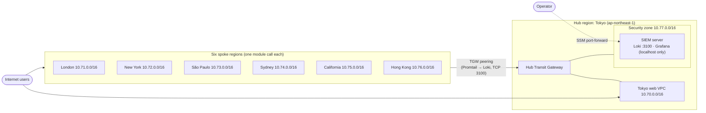

# Multi-Region Hub-and-Spoke Web Application with Centralized SIEM

Terraform for a seven-region AWS web application with a hub-and-spoke Transit Gateway network and a central log-collection stack (Promtail, Loki, Grafana) in a dedicated security zone.

The project began as an instructor-led lab. I rebuilt it as a reusable Terraform design: the six near-identical regional files became one module, and I reworked the security posture and the log-forwarding path (details under [What I changed](#what-i-changed-from-the-original-lab)).

> **Scope:** This is a portfolio lab, not a production deployment. It uses plain HTTP on the load balancers, a single NAT gateway per VPC, and local-disk Loki storage.

## What this project demonstrates

- Multi-region AWS infrastructure from one Terraform root using provider aliases
- A reusable module (`web-stack`) that builds a VPC, ALB and Auto Scaling group; the same module is used in all seven regions
- Hub-and-spoke networking with Transit Gateways, cross-region peering, explicit route tables and no default association or propagation
- Centralized logging: Promtail on every web instance, Loki and Grafana on one SIEM server
- Least-privilege network design: no SSH, no inbound Grafana, Loki reachable only from the web VPC CIDRs
- Instance hardening: IMDSv2 required, encrypted EBS volumes, unprivileged log agents, checksum-verified downloads

## Architecture



Each web VPC contains two public subnets (ALB, NAT gateway), two private subnets (Auto Scaling group of Apache instances) and its own internet gateway. Web instances run Promtail and push logs to Loki over the Transit Gateway mesh.

### Address plan

| VPC | Region | CIDR |
| --- | --- | --- |
| Tokyo web (hub) | ap-northeast-1 | 10.70.0.0/16 |
| London | eu-west-2 | 10.71.0.0/16 |
| New York | us-east-1 | 10.72.0.0/16 |
| São Paulo | sa-east-1 | 10.73.0.0/16 |
| Sydney | ap-southeast-2 | 10.74.0.0/16 |
| California | us-west-1 | 10.75.0.0/16 |
| Hong Kong | ap-east-1 | 10.76.0.0/16 |
| Security zone | ap-northeast-1 | 10.77.0.0/16 |

### Routing model

- Each spoke has its own TGW, peered to the hub TGW. Spokes can reach the Tokyo web VPC and the security zone. They **cannot** reach each other, because no spoke route table has a route to another spoke.
- The hub TGW has one route table. Its routes point to each spoke's peering attachment, the Tokyo web VPC and the security zone.
- Default route-table association and propagation are disabled on every TGW, so every route is declared in code.

## Repository layout

```text
03-multi-region-siem-hub-spoke/
├── README.md
├── .gitignore
└── terraform/
    ├── versions.tf            # Terraform and provider constraints
    ├── providers.tf           # One aliased provider per region + default tags
    ├── locals.tf              # Address plan, pinned Loki version and checksums
    ├── variables.tf
    ├── hub.tf                 # Hub TGW, Tokyo web VPC, security zone, SIEM server
    ├── spokes.tf              # Six module calls, one per spoke region
    ├── outputs.tf
    ├── backend.tf.example     # Optional S3 remote state
    ├── scripts/
    │   ├── promtail-web.sh.tftpl        # Web tier: Apache + Promtail
    │   └── siem-loki-grafana.sh.tftpl   # SIEM: Loki + Grafana
    └── modules/
        ├── web-stack/         # VPC, subnets, NAT, ALB, ASG (used in all 7 regions)
        └── spoke/             # web-stack + spoke TGW + peering to the hub
```

## Security decisions

| Area | Decision | Why |
| --- | --- | --- |
| Operator access | AWS Systems Manager Session Manager. There is no bastion, no SSH rule and no key pair. | Removes an internet-facing SSH surface. Access is authenticated by IAM and logged by AWS. |
| Grafana | Bound to `127.0.0.1` and reached through an SSM port-forward | No inbound rule for port 3000 is needed. |
| Loki ingest | Security group allows TCP 3100 only from the seven web VPC CIDRs | The original lab allowed `0.0.0.0/0`. |
| SIEM egress | HTTPS (443) only | Limits what the instance can reach. |
| Instance metadata | IMDSv2 required, hop limit 1 | Reduces the impact of SSRF against the metadata service. |
| Storage | Encrypted gp3 root volumes | Encryption at rest. |
| Log agents | Promtail and Loki run as dedicated system users. Promtail gets only `CAP_DAC_READ_SEARCH` to read root-owned logs. | No agent runs as root. |
| Supply chain | Loki/Promtail version pinned; SHA-256 verified before install | Stops a tampered or swapped download from being installed. |
| IAM | AWS-managed `AmazonSSMManagedInstanceCore` only | Replaces a hand-written policy that used `Resource = "*"`. |
| Default security groups | Explicitly emptied in every VPC | Nothing can rely on the permissive default. |
| ALB | Only accepts HTTP from the internet and only forwards to the web security group; drops invalid headers | Narrow blast radius. |

## Prerequisites

- Terraform 1.6 or newer (1.10 or newer if you enable the S3 backend with `use_lockfile`)
- AWS credentials with permission to create VPC, EC2, ELB, IAM and Transit Gateway resources in all seven regions
- **Hong Kong (`ap-east-1`) enabled** in your AWS account. It is an opt-in region.
- AWS CLI and the [Session Manager plugin](https://docs.aws.amazon.com/systems-manager/latest/userguide/session-manager-working-with-install-plugin.html) to reach Grafana

## Deploy

```bash
cd terraform

# Optional: remote state. Copy backend.tf.example to backend.tf and edit the bucket name.
terraform init
terraform validate
terraform plan -out tfplan
terraform apply tfplan
```

Transit Gateway peering attachments take several minutes to become available, so a full apply can take 15 to 25 minutes.

## Validate

1. Load each ALB in a browser. The page reports the region and availability zone that served it.

   ```bash
   terraform output web_endpoints
   ```

2. Open Grafana through Session Manager:

   ```bash
   terraform output -raw grafana_port_forward_command   # run the printed command
   # then browse to http://localhost:3000  (default login admin / admin; you are forced to change it)
   ```

3. In Grafana, open **Explore**, choose the **Loki** data source (pre-provisioned) and run:

   ```logql
   {job="httpd"}
   ```

   Requests from the ALB health checks in every region should appear, with a `region` label per source.

## Cost warning

This stack creates 8 NAT gateways, 7 Application Load Balancers, 14 web instances, a SIEM instance and 14 Transit Gateway attachments (8 VPC attachments and 6 cross-region peerings). As a rough estimate, expect **roughly $1.50 to $2.50 per hour** (on the order of $40 to $60 per day) plus data transfer. Check current prices with the AWS Pricing Calculator. **Deploy for a short test, capture your evidence, then destroy.**

## Teardown

```bash
cd terraform
terraform destroy
```

Confirm in the console that no NAT gateways, Elastic IPs, load balancers or Transit Gateway attachments remain in any of the seven regions.

## What I changed from the original lab

- **Six near-identical 7 KB region files became one module.** Each spoke is now one module call. Adding a region no longer means copy-pasting 280 lines.
- **Fixed the log path.** The lab's spoke route tables only pointed at the Tokyo web VPC, but Loki lives in the separate security-zone VPC. Spoke routes, hub TGW routes and the security-zone return routes now cover both networks.
- **Fixed a São Paulo bug:** its internet-facing ALB had been placed in private subnets. The shared module puts every ALB in public subnets.
- **Fixed the Promtail placeholder.** The web-tier script contained a literal `<LOKI_SERVER_IP>`. The SIEM now has a fixed private IP that Terraform passes to every web instance.
- **Replaced the SSH bastion with SSM**, removed the world-open Loki rule and the broad IAM policy, and moved both agents off root (see the table above).
- **Grafana data source is now provisioned in code.** The original README claimed this but the script never did it.
- **Removed hard-coded values:** AMI IDs (now the latest Amazon Linux 2023 through SSM parameters), Availability Zone names, the SSH key name, and the S3 state bucket.
- **Added explicit dependencies** so route-table associations wait until the hub has accepted each peering attachment.

## Known limitations

- HTTP only. A production version would terminate TLS on the ALB with an ACM certificate.
- One NAT gateway per VPC, so a NAT or AZ failure would cut off outbound access for that VPC.
- Loki uses local disk on a single instance. Logs are lost if the instance is replaced. A production design would use S3 storage.
- The Grafana default admin password is in place until first login. It is only reachable through SSM.
- No VPC Flow Logs, GuardDuty or CloudTrail integration yet.

## Future enhancements

- S3-backed Loki storage and a retention policy
- Terraform-managed Grafana dashboards and alert rules
- VPC Flow Logs into the same Loki pipeline
- TLS on the ALBs and WAF in front of them
- A CI job (`terraform fmt`, `validate`, `tflint`, `checkov`) on every pull request

## Verification status

| Check | Status |
| --- | --- |
| `terraform fmt` | Clean |
| HCL syntax and internal references (script-based check) | Clean |
| Bootstrap scripts (`bash -n`) | Clean |
| `terraform validate` / `terraform plan` | **Pending: run locally before merging** |
| `terraform apply` in AWS, with screenshots and command output added under `evidence/` | **Pending** |
