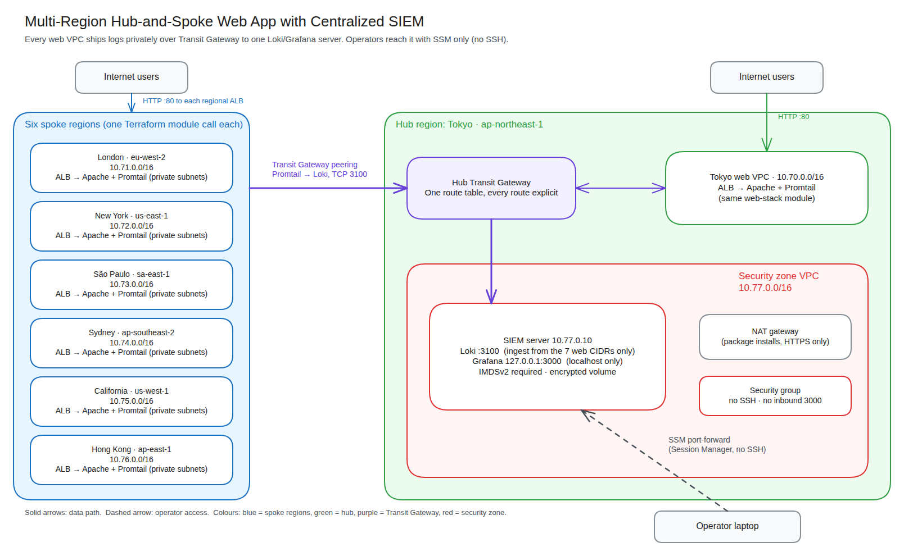
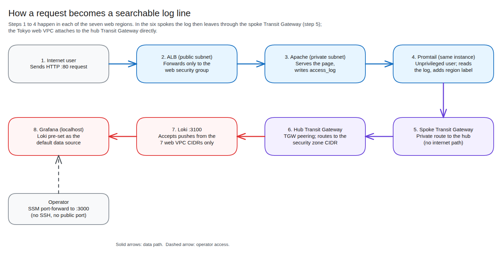

# Multi-Region Hub-and-Spoke Web Application with Centralized SIEM


Terraform for a seven-region AWS web application with a Transit Gateway hub-and-spoke network and a central log-collection stack (Promtail, Loki, Grafana) in a dedicated security zone. Rebuilt from an instructor-led lab into a modular, security-hardened design.

> **Scope:** This is a portfolio lab, not a production deployment. It uses plain HTTP on the load balancers, one NAT gateway per VPC and local-disk Loki storage. See [Known limitations](#known-limitations).

## At a glance

| | |
| --- | --- |
| **Problem** | Web workloads in seven regions need their logs collected in one place, without exposing the log server to the internet. |
| **Solution** | Every region runs the same web stack. Transit Gateways carry Promtail log traffic privately to a Loki/Grafana server in a Tokyo security zone. |
| **Infrastructure** | 7 web VPCs, 1 security VPC, 7 Transit Gateways, 7 load balancers, 14 web instances, 1 SIEM server |
| **Code** | About 1,100 lines of Terraform. The six spoke regions share one module and are each created by a short module call. |
| **Access model** | AWS Systems Manager Session Manager only: no SSH, no bastion, no key pairs |
| **Deploy time** | About 15 to 25 minutes (peering attachments are the slow part) |
| **Cost while running** | Roughly $1.50 to $2.50 per hour. Destroy when done. |
| **Skills shown** | Terraform modules and provider aliases, Transit Gateway routing, least-privilege network design, IMDSv2, centralized logging, supply-chain checks |

## Interview talk track

**Recruiter or hiring manager (30 seconds)**
"I took an instructor-led multi-region lab and rebuilt it as a modular Terraform project. Six copy-pasted region files became one module, and I found and fixed several problems, including a routing gap that would have stopped logs from ever reaching the SIEM. It collects web logs from seven regions into one Grafana instance, and the log server has no public exposure."

**Security engineer or CISO**
"The design assumes nothing should be reachable that doesn't need to be. There's no SSH: operators use Session Manager, and Grafana listens on localhost only. Loki accepts traffic only from the seven web VPC CIDRs. Instances require IMDSv2 and encrypted volumes, log agents run as unprivileged users, and the software downloads are checksum-verified. Spokes can reach the hub but not each other, and every Transit Gateway route is explicit."

## Contents

1. [Architecture](#architecture)
2. [Security decisions](#security-decisions)
3. [Quick start](#quick-start)
4. [Validate it works](#validate-it-works)
5. [Evidence](#evidence)
6. [Cost and teardown](#cost-and-teardown)
7. [Troubleshooting](#troubleshooting)
8. [What I changed from the original lab](#what-i-changed-from-the-original-lab)
9. [Known limitations](#known-limitations)
10. [Future enhancements](#future-enhancements)
11. [References](#references)

## Architecture



<sub>Editable source: [`diagrams/siem-architecture.excalidraw`](diagrams/siem-architecture.excalidraw). Open it at [excalidraw.com](https://excalidraw.com) to change it.</sub>

Each web VPC contains two public subnets (ALB, NAT gateway), two private subnets (Auto Scaling group of Apache instances) and its own internet gateway. Web instances run Promtail and push logs to Loki over the Transit Gateway mesh.

### Address plan

| VPC | Region | CIDR |
| --- | --- | --- |
| Tokyo web (hub) | ap-northeast-1 | 10.70.0.0/16 |
| London | eu-west-2 | 10.71.0.0/16 |
| New York | us-east-1 | 10.72.0.0/16 |
| São Paulo | sa-east-1 | 10.73.0.0/16 |
| Sydney | ap-southeast-2 | 10.74.0.0/16 |
| California | us-west-1 | 10.75.0.0/16 |
| Hong Kong | ap-east-1 | 10.76.0.0/16 |
| Security zone | ap-northeast-1 | 10.77.0.0/16 |

### Routing model

- Each spoke has its own TGW, peered to the hub TGW. Spokes can reach the Tokyo web VPC and the security zone. They **cannot** reach each other, because no spoke route table has a route to another spoke.
- The hub TGW has one route table. Its routes point to each spoke's peering attachment, the Tokyo web VPC and the security zone.
- Default route-table association and propagation are disabled on every TGW, so every route is declared in code.

### How the logs travel



<sub>Editable source: [`diagrams/siem-log-flow.excalidraw`](diagrams/siem-log-flow.excalidraw)</sub>

1. A user request reaches a regional ALB and is forwarded to an Apache instance in a private subnet.
2. Apache writes an access log line. Promtail, running on the same instance, reads it.
3. Promtail pushes the line to Loki at `10.77.0.10:3100`. The packet leaves the spoke VPC through its Transit Gateway, crosses the peering to the hub Transit Gateway, and enters the security zone.
4. Loki stores the line. Grafana, which is pre-configured with Loki as its data source, lets you query it.
5. You reach Grafana only through an SSM port-forward from your laptop.

## Security decisions

| Area | Decision | Why |
| --- | --- | --- |
| Operator access | AWS Systems Manager Session Manager. There is no bastion, no SSH rule and no key pair. | Removes an internet-facing SSH surface. Access is authenticated by IAM and logged by AWS. |
| Grafana | Bound to `127.0.0.1` and reached through an SSM port-forward | No inbound rule for port 3000 is needed. |
| Loki ingest | Security group allows TCP 3100 only from the seven web VPC CIDRs | The original lab allowed `0.0.0.0/0`. |
| SIEM egress | HTTPS (443) only | Limits what the instance can reach. |
| Instance metadata | IMDSv2 required, hop limit 1 | Reduces the impact of SSRF against the metadata service. |
| Storage | Encrypted gp3 root volumes | Encryption at rest. |
| Log agents | Promtail and Loki run as dedicated system users. Promtail gets only `CAP_DAC_READ_SEARCH` to read root-owned logs. | No agent runs as root. |
| Supply chain | Loki/Promtail version pinned; SHA-256 verified before install | Stops a tampered or swapped download from being installed. |
| IAM | AWS-managed `AmazonSSMManagedInstanceCore` only | Replaces a hand-written policy that used `Resource = "*"`. |
| Default security groups | Explicitly emptied in every VPC | Nothing can rely on the permissive default. |
| ALB | Only accepts HTTP from the internet and only forwards to the web security group; drops invalid headers | Narrow blast radius. |

## Quick start

<details>
<summary><b>Prerequisites</b></summary>

- Terraform 1.6 or newer (1.10 or newer if you use the S3 backend with `use_lockfile`)
- AWS credentials that can create VPC, EC2, ELB, IAM and Transit Gateway resources in all seven regions
- **Hong Kong (`ap-east-1`) enabled** in your AWS account. It is an opt-in region.
- AWS CLI and the [Session Manager plugin](https://docs.aws.amazon.com/systems-manager/latest/userguide/session-manager-working-with-install-plugin.html)

</details>

```bash
cd terraform
terraform init
terraform validate
terraform plan -out tfplan
terraform apply tfplan
```

Optional remote state: copy `backend.tf.example` to `backend.tf` (git-ignored) and edit the bucket name before `terraform init`.

## Validate it works

1. **Web tiers:** open each ALB address. The page shows the region and availability zone that served it.

   ```bash
   terraform output web_endpoints
   ```

2. **Grafana:** open a tunnel through Session Manager, then browse to `http://localhost:3000` (default login `admin` / `admin`, and you are forced to change it).

   ```bash
   terraform output -raw grafana_port_forward_command   # run the command it prints
   ```

3. **Logs from every region:** in Grafana, go to **Explore**, choose the **Loki** data source and run:

   ```logql
   {job="httpd"}
   ```

   ALB health-check requests should appear from all seven regions, each with a `region` label.

## Evidence

| Check | Status | Where |
| --- | --- | --- |
| `terraform fmt` | Passed | Verified during development |
| HCL syntax and internal references | Passed | Script-based check |
| Bootstrap scripts (`bash -n`) | Passed | Verified during development |
| `terraform validate` and `plan` | Pending | To be added under `evidence/` |
| Deployed in AWS: ALB pages from each region | Pending | Screenshots to be added under `evidence/` |
| Deployed in AWS: Grafana showing logs from all regions | Pending | Screenshots to be added under `evidence/` |

## Cost and teardown

This stack creates 8 NAT gateways, 7 Application Load Balancers, 14 web instances, a SIEM instance and 14 Transit Gateway attachments (8 VPC attachments and 6 cross-region peerings). As a rough estimate, expect **$1.50 to $2.50 per hour** (about $40 to $60 per day) plus data transfer. Check current prices with the AWS Pricing Calculator. **Deploy for a short test, capture your evidence, then destroy.**

```bash
cd terraform
terraform destroy
```

Afterwards, confirm in the console that no NAT gateways, Elastic IPs, load balancers or Transit Gateway attachments remain in any of the seven regions.

## Troubleshooting

| Symptom | Likely cause | What to do |
| --- | --- | --- |
| `terraform apply` fails only for Hong Kong | `ap-east-1` is an opt-in region | Enable it in the AWS account settings, wait a few minutes, re-run |
| Apply errors on a peering association or route | The hub had not finished accepting the peering | Re-run `terraform apply`. Peering can take several minutes. |
| SSM session will not start | Missing Session Manager plugin, or the instance cannot reach SSM | Install the plugin, then check the instance role and its outbound 443 path through the NAT gateway |
| ALB returns 502 or 503 | Instances still booting, or bootstrap failed | Wait 5 minutes. Then check `/var/log/cloud-init-output.log` on an instance through SSM. |
| Bootstrap stops at `sha256sum` | The pinned checksum does not match the downloaded version | Update the version and both checksums in `locals.tf` together |
| Grafana shows no logs | Promtail cannot reach Loki | On a web instance, run `systemctl status promtail` and `curl http://10.77.0.10:3100/ready` |
| Promtail cannot read Apache logs | Capability missing from the service unit | Check `AmbientCapabilities=CAP_DAC_READ_SEARCH` in `/etc/systemd/system/promtail.service` |
| `terraform destroy` leaves resources | A dependency was still deleting | Re-run `terraform destroy`, then check each region for leftover NAT gateways and ENIs |

## What I changed from the original lab

- **Six near-identical 7 KB region files became one module.** Each spoke is now one module call. Adding a region no longer means copy-pasting 280 lines.
- **Fixed the log path.** The lab's spoke route tables only pointed at the Tokyo web VPC, but Loki lives in the separate security-zone VPC. Spoke routes, hub TGW routes and the security-zone return routes now cover both networks.
- **Fixed a São Paulo bug:** its internet-facing ALB had been placed in private subnets. The shared module puts every ALB in public subnets.
- **Fixed the Promtail placeholder.** The web-tier script contained a literal `<LOKI_SERVER_IP>`. The SIEM now has a fixed private IP that Terraform passes to every web instance.
- **Replaced the SSH bastion with SSM**, removed the world-open Loki rule and the broad IAM policy, and moved both agents off root (see the table above).
- **Grafana data source is now provisioned in code.** The original README claimed this but the script never did it.
- **Removed hard-coded values:** AMI IDs (now the latest Amazon Linux 2023 through SSM parameters), Availability Zone names, the SSH key name, and the S3 state bucket.
- **Added explicit dependencies** so route-table associations wait until the hub has accepted each peering attachment.

## Known limitations

- HTTP only. A production version would terminate TLS on the ALB with an ACM certificate.
- One NAT gateway per VPC, so a NAT or AZ failure would cut off outbound access for that VPC.
- Loki uses local disk on a single instance. Logs are lost if the instance is replaced. A production design would use S3 storage.
- The Grafana default admin password is in place until first login. It is only reachable through SSM.
- No VPC Flow Logs, GuardDuty or CloudTrail integration yet.

## Future enhancements

- S3-backed Loki storage and a retention policy
- Terraform-managed Grafana dashboards and alert rules
- VPC Flow Logs into the same Loki pipeline
- TLS on the ALBs and WAF in front of them
- A CI job (`terraform fmt`, `validate`, `tflint`, `checkov`) on every pull request

## References

- [Amazon VPC Transit Gateway: inter-Region peering](https://docs.aws.amazon.com/vpc/latest/tgw/tgw-peering.html)
- [AWS Systems Manager Session Manager](https://docs.aws.amazon.com/systems-manager/latest/userguide/session-manager.html)
- [Instance Metadata Service Version 2](https://docs.aws.amazon.com/AWSEC2/latest/UserGuide/configuring-instance-metadata-service.html)
- [Terraform: multiple provider configurations](https://developer.hashicorp.com/terraform/language/providers/configuration)
- [Terraform: module composition and provider passing](https://developer.hashicorp.com/terraform/language/modules/develop/providers)
- [Grafana Loki documentation](https://grafana.com/docs/loki/latest/)
- [Promtail documentation](https://grafana.com/docs/loki/latest/send-data/promtail/)

## Repository layout

<details>
<summary>Show the file tree</summary>

```text
03-multi-region-siem-hub-spoke/
├── README.md
├── .gitignore
├── diagrams/                  # Excalidraw sources plus PNG and SVG exports
└── terraform/
    ├── versions.tf            # Terraform and provider constraints
    ├── providers.tf           # One aliased provider per region + default tags
    ├── locals.tf              # Address plan, pinned Loki version and checksums
    ├── variables.tf
    ├── hub.tf                 # Hub TGW, Tokyo web VPC, security zone, SIEM server
    ├── spokes.tf              # Six module calls, one per spoke region
    ├── outputs.tf
    ├── backend.tf.example     # Optional S3 remote state
    ├── scripts/
    │   ├── promtail-web.sh.tftpl        # Web tier: Apache + Promtail
    │   └── siem-loki-grafana.sh.tftpl   # SIEM: Loki + Grafana
    └── modules/
        ├── web-stack/         # VPC, subnets, NAT, ALB, ASG (used in all 7 regions)
        └── spoke/             # web-stack + spoke TGW + peering to the hub
```

</details>
