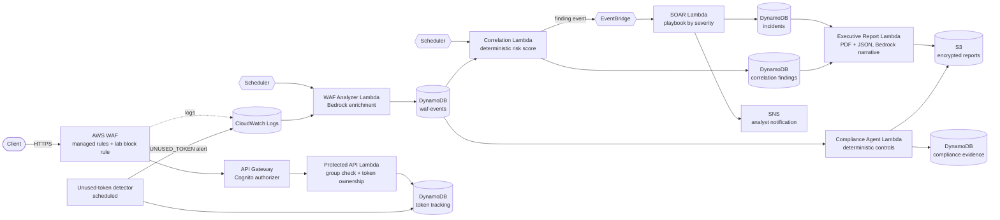

# WAF to Bedrock Threat Correlation to SOAR Pipeline


Terraform and Python for an AWS pipeline that reads WAF logs, correlates them into scored findings, opens incidents through EventBridge, produces executive and compliance reports, and protects its own API with Cognito MFA and group-based access. Amazon Bedrock explains results. Deterministic code makes every decision.

> **Scope:** This is a portfolio lab, not a production deployment. Containment is never automated, the controls library has four checks wired into the final report, and the shared domain models (Lab 12D) are not yet connected to the Lambdas. See [Known limitations](#known-limitations).

## At a glance

| | |
| --- | --- |
| **Problem** | WAF logs are noisy. A team needs scored findings, incidents and reports it can trust, and it cannot let a language model decide severity or trigger containment. |
| **Solution** | Scheduled Lambdas analyze WAF logs and correlate events into findings. EventBridge routes findings to a SOAR Lambda that opens incidents and notifies by SNS. Bedrock only writes the narrative. |
| **Infrastructure** | 75 Terraform-managed resources: 7 Lambdas, 1 WAF web ACL, 1 REST API, DynamoDB tables, EventBridge rules and schedules, SNS topics, an encrypted S3 report bucket, and a Cognito user pool with three groups |
| **Code** | About 6,600 lines of Python across 7 Lambda sources and 37 Terraform files, plus a 9-test Pydantic domain-model package (Lab 12D) |
| **Access model** | Cognito with required TOTP MFA. Viewer, analyst and administrator groups. Per-call token ownership checks. |
| **Safety boundary** | `human_review_required: true` and `containment_performed: false` on every HIGH and CRITICAL incident in the evidence |
| **Teardown** | Every deployment was destroyed and checked: Terraform state at zero resources and a per-service AWS inventory of zeros |
| **Skills shown** | Terraform, event-driven AWS, WAF, Bedrock with deterministic guardrails, Cognito and API Gateway authorizers, IAM least privilege, evidence-driven validation |

## Contents

- [Architecture](#architecture)
- [Security decisions](#security-decisions)
- [How it grew from Lab 12 to Lab 12D](#how-it-grew-from-lab-12-to-lab-12d)
- [Quick start](#quick-start)
- [Validate it works](#validate-it-works)
- [Evidence](#evidence)
- [What I changed or added](#what-i-changed-or-added)
- [Known limitations](#known-limitations)
- [Credits](#credits)
- [Repository layout](#repository-layout)

## Architecture



Seven stages, each with one job:

| Stage | Lambda source | What it does |
| --- | --- | --- |
| Detect | WAF web ACL | One deterministic block rule (a lab trigger header) and the AWS managed Common Rule Set |
| Analyze | [`waf_bedrock_analyzer.py`](src/waf_bedrock_analyzer.py) | Reads recent WAF log events, stores them, and asks Bedrock for an explanation |
| Correlate | [`waf_threat_correlation_agent.py`](src/waf_threat_correlation_agent.py) | Scores events with fixed rules and writes a finding |
| Respond | [`soar_response_agent.py`](src/soar_response_agent.py) | Picks a playbook from severity, opens an incident, notifies by SNS |
| Report | [`executive_dashboard_agent.py`](src/executive_dashboard_agent.py) | Computes metrics, renders a PDF and a JSON file with the same report ID |
| Comply | [`compliance.py`](lambda/compliance.py) | Evaluates controls from [`controls.json`](json/controls.json) and records one evidence item per control |
| Protect | [`protected_api_handler.py`](src/protected_api_handler.py), [`unused_token_detector.py`](src/unused_token_detector.py) | Authorizes callers and tracks whether each issued token was used |

### How severity and response work

The correlation Lambda adds points for event volume (5+ and 15+ events), distinct URIs, distinct rules, all events blocked, and a burst of 5+ events inside 5 minutes. The score maps to a severity: 80+ CRITICAL, 60+ HIGH, 30+ MEDIUM, otherwise LOW. The SOAR Lambda maps severity to a playbook:

| Severity | Playbook | Notifies | Priority |
| --- | --- | --- | --- |
| LOW | `RECORD_ONLY` | No | 4 |
| MEDIUM | `NOTIFY_ANALYST` | Yes | 3 |
| HIGH | `CREATE_AND_ESCALATE_INCIDENT` | Yes | 2 |
| CRITICAL | `REQUEST_URGENT_REVIEW` | Yes | 1 |

No playbook contains a containment action. Re-delivering the same finding does not create a second incident (see the idempotent retry screenshot in [Evidence](#evidence)).

## Security decisions

| Decision | Why |
| --- | --- |
| **Bedrock never decides.** Severity, playbook selection, compliance PASS/FAIL/REVIEW and scores are computed in Python. | A model that can change a severity can be talked into changing one. Explanations are useful, authority is not. |
| **Unknown control types return `REVIEW`, never PASS.** | A control the code cannot evaluate must reach a human. It must not silently count toward the score. |
| **Humans approve containment.** Incidents are created with `human_review_required: true` and `containment_performed: false`. | Blocking an IP or disabling an account is the action a mistaken finding would hurt most. |
| **Cognito MFA is required (`mfa_configuration = "ON"`, TOTP).** Access and ID tokens last one hour, revocation is enabled. | The API sits behind real identity, not a shared key. |
| **Three groups, one allow-list.** Only `security-analysts` and `security-admins` pass the handler. `security-viewers` gets 403. | Group claims come from the verified token, so the handler checks a signed fact. |
| **Token ownership is checked twice.** The handler compares the record's owner to the caller, then the DynamoDB update carries a `ConditionExpression` (record exists and `username` matches). `used_at` is written with `if_not_exists`, so the first-use time is kept. | A caller cannot mark or use another user's token, even if the record changes between the read and the write. |
| **An unused-token detector alerts on stale, never-used tokens.** | A token that was issued and never used is worth a human look. |
| **Schedules are off by default** (`enable_schedules`), and DynamoDB point-in-time recovery is off to limit lab cost. | A lab should not bill while idle. |
| **Report bucket: encryption and Block Public Access.** | Reports contain security posture. |

## How it grew from Lab 12 to Lab 12D

Five labs built one platform, and each lab kept the controls of the one before. This project ships the final state. The Terraform for Lab 12C already contains the whole stack from Lab 12 onwards. [`docs/lab-progression.md`](docs/lab-progression.md) has the detail and each original lab README is under [`docs/labs/`](docs/labs/).

| Lab | Added | Result |
| --- | --- | --- |
| 12 | WAF, API Gateway, analyzer and correlation Lambdas, DynamoDB, Bedrock enrichment | Blocked request becomes a stored correlation finding |
| 12A | EventBridge, SOAR Lambda, SNS, incidents table | 47-resource deployment. HIGH and CRITICAL paths, no duplicate incidents. |
| 12B | Executive report Lambda, ReportLab layer, S3 | 58-resource deployment. PDF and JSON generated with one report ID. |
| 12C | Compliance agent, Cognito MFA and groups, token tracking, unused-token detector | 75-resource deployment. RBAC test matrix below. |
| 12D | Pydantic domain models for evidence, threats, responses and reports | No AWS. 9 tests pass. |

Lab 12E (MCP-based orchestration) is in progress and is not part of this project.

## Quick start

Prerequisites: Terraform 1.5 or later, AWS credentials for a sandbox account, Python 3.12 and `zip`, and Bedrock model access in `us-east-1`.

```bash
cd projects/04-waf-bedrock-threat-correlation-and-soar-pipeline

# 1. Build the ReportLab Lambda layer (writes terraform/reportlab-python312-x86_64.zip)
bash scripts/build-reportlab-layer.sh

# 2. Fill in your own values. terraform.tfvars is git-ignored.
cd terraform
cp terraform.tfvars.example terraform.tfvars
$EDITOR terraform.tfvars   # notification_email, bedrock_model_id, bedrock_resource_arns

# 3. Review the plan before applying
terraform init
terraform plan -out=lab.tfplan
terraform apply lab.tfplan
```

The Lambdas are packaged by `archive_file` from `../src`, `../lambda` and `../json`, so keep this folder layout. Schedules start disabled. Invoke the Lambdas with the events in [`test-events/`](test-events/).

Tear down with `terraform plan -destroy -out=destroy.tfplan`, read it, then apply it.

## Validate it works

The access matrix from the Lab 12C deployment, run against the live API:

| Call | Expected |
| --- | --- |
| No Cognito token | 401 |
| Viewer | 403 |
| Analyst, no `x-token-id` header | 400 |
| Analyst, token they own | 200 |
| Analyst, someone else's token | 403 |
| Administrator, token they own | 200 |

After a successful call the token record flips from `used=false` to `used=true`. An issued token that is never used produces an `UNUSED_TOKEN` alert in CloudWatch Logs.

The Lab 12D domain models have their own tests:

```bash
cd domain-models
python3 -m venv .venv && . .venv/bin/activate
pip install -r requirements.txt pytest
pytest -q tests        # 9 passed
```

## Evidence

Evidence comes from real deployments in `us-east-1` in August 2026. Request IDs, API IDs, source IPs and identity details are redacted, and the AWS account ID is shown as `123456789012`. See [`evidence/README.md`](evidence/README.md) for the full index.

| Screenshot | Shows |
| --- | --- |
| [WAF allow and block](evidence/screenshots/lab12-06-api-gateway-allowed-and-waf-blocked.png) | The same API returns 200 for a normal request and 403 for a WAF-blocked one |
| [Analyzer run](evidence/screenshots/lab12-08-bedrock-enriched-analyzer-response.png) | 3 events found, stored and analyzed, 0 failed |
| [Correlation finding](evidence/screenshots/lab12-10-dynamodb-correlation-finding.png) | A stored finding with severity, risk score and event count |
| [HIGH incident](evidence/screenshots/lab12a-05-high-severity-end-to-end-workflow.png) | `CREATE_AND_ESCALATE_INCIDENT`, human review required, no containment |
| [CRITICAL incident](evidence/screenshots/lab12a-07-critical-soar-workflow.png) | `REQUEST_URGENT_REVIEW`, human review required, no containment |
| [Idempotent retry](evidence/screenshots/lab12a-06-idempotent-retry-skipped.png) | A second delivery is skipped and no duplicate incident is created |
| [Executive report](evidence/screenshots/lab12b-17-executive-report-publication-verified.png) | PDF and JSON present, encrypted (AES256), same report ID |
| [No drift](evidence/screenshots/lab12-11-terraform-no-drift.png) | `terraform plan` reports no changes |
| [State empty](evidence/screenshots/lab12b-24-post-destroy-terraform-state-empty.png) | Zero managed resources after destroy |
| [AWS inventory](evidence/screenshots/lab12b-25-post-destroy-aws-resources-zero.png) | Lambda, DynamoDB, EventBridge, SNS, API Gateway, WAF, S3 and log groups all at 0 |

Artifacts: a populated [executive report](evidence/artifacts/20-populated-executive-security-report.pdf) with its [JSON](evidence/artifacts/20-populated-executive-security-report.json), and the [Lab 12C compliance report](evidence/artifacts/lab12c-final-compliance-report.redacted.json) (redacted; the account ID was replaced, so any hash recorded inside it no longer matches the original file).

## What I changed or added

This project comes from **Armageddon #2**, a team lab in the SEIR Foundations class. The class lab set the pipeline stages. I built these labs individually on separate branches, and the group's submission was Kirk Alton's version (see [Credits](#credits)). My implementation, Terraform, tests and write-ups are in this folder.

- **One platform instead of five lab folders.** The portfolio shows the final state and a short history, not six near-copies.
- **Deterministic decisions, enforced in code.** Severity, playbooks and compliance results are computed. Bedrock output is stored as an explanation only.
- **A safe fallback for unknown controls.** Anything the compliance agent cannot evaluate becomes `REVIEW`.
- **Authentication and RBAC on the API (Lab 12C).** Cognito with required MFA, three groups, an authorizer on the API method and a handler that checks the group claim.
- **Token telemetry and unused-token detection (Lab 12C).** Atomic ownership checks and a scheduled detector.
- **Shared domain models (Lab 12D).** Pydantic contracts with controlled vocabularies, assignment validation, and a report lifecycle that makes a final report immutable.
- **Teardown discipline.** Reviewed destroy plans, zero-resource state checks and an AWS-side inventory after every deployment.
- **Publication hygiene for this repository.** I removed `terraform.tfvars`, plans, state, vendored libraries, macOS duplicates and caches, kept `.tfvars.example`, checked every screenshot and PDF for identifiers, and replaced the account ID in the one report that contained it.

## Known limitations

- **Lab, not production.** One region, one environment, no CI/CD pipeline, no multi-account setup.
- **Compliance coverage is narrow.** The final report evaluates four controls and scores 4 of 4 (100%). Those checks confirm that resources exist and hold records, not that they are configured securely. A 100% score here is not a security claim.
- **The Lab 12D models are not wired into the Lambdas.** They define the contracts the Lambdas should share. The Lambdas still use their own dict handling.
- **Tokens are tracked, not single-use.** A token that was already used still succeeds. `used` records whether a token was ever used so the detector can flag the ones that were not. Making tokens one-time would need a `used = false` condition on the write.
- **The unused-token detector scans the whole token table.** That is fine at lab scale. At volume it needs an index on `used` or a TTL-driven design.
- **Lab triggers.** The deterministic WAF block rule fires on a lab header, so tests are repeatable. It is not a real attack signature.
- **No automated containment, by design.** Responding to a finding is a human step.
- **Evidence is partial.** I chose 10 of 37 unique screenshots that tell the story. Several others were left out because they show identifiers (account ID, a personal email) and would need redaction first. The Lab 12C evidence is a redacted JSON report with no screenshots, and its PDF is omitted because it embeds the account ID in a bucket name.
- **Not exercised here.** I did not run `terraform validate` or `plan` for this repository copy. The deployments in the evidence ran from the lab repository.
- **Lab 12E** (MCP orchestration) is unfinished and excluded.

## Credits

- **Class lab:** Armageddon #2, SEIR Foundations (instructor-led).
- **Group:** Jacques Payne (author and group leader), Joe Tolliver, Jr., Cautchy Bailly and Kirk Alton. Members kept individual work areas and branches. The group's submission was Kirk Alton's version.
- **This project** contains only my own work. It does not include any other member's files.

## Repository layout

```text
.
├── README.md
├── terraform/       cumulative stack: Labs 12, 12A, 12B, 12C (75 resources) + tfvars.example
├── src/             Lambda sources: analyzer, correlation, SOAR, executive report, API handler, detector
├── lambda/          compliance agent
├── json/            controls library and test event
├── layers/          ReportLab layer requirements (built by scripts/)
├── scripts/         layer build and validation helpers
├── test-events/     Lambda test payloads
├── runbooks/        operating runbooks for each stage
├── domain-models/   Lab 12D Pydantic models and tests (no AWS)
├── evidence/        redacted screenshots and report artifacts
├── diagrams/        architecture sources
└── docs/            lab progression and original lab READMEs
```
