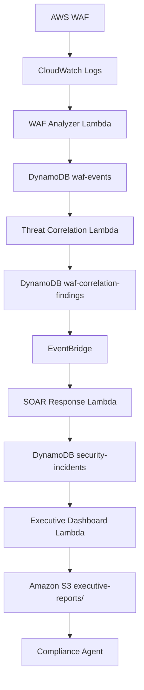
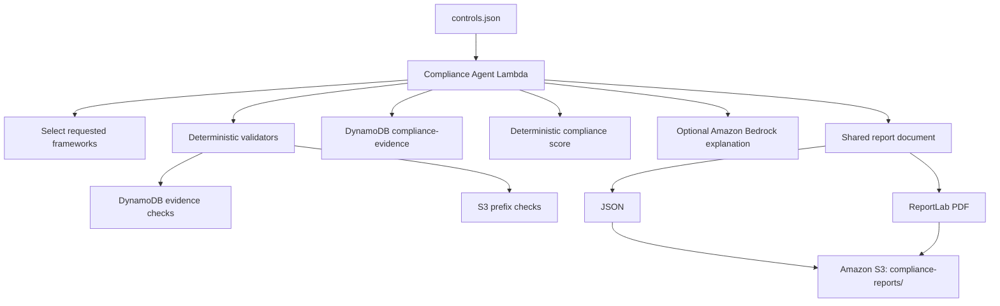
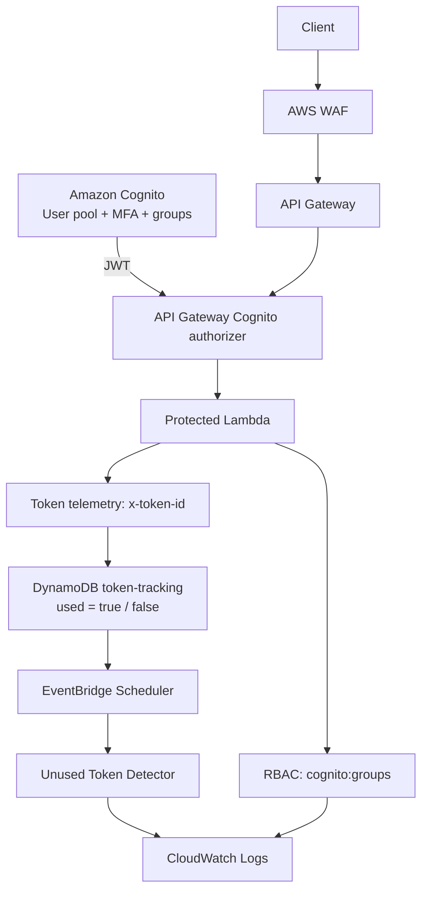
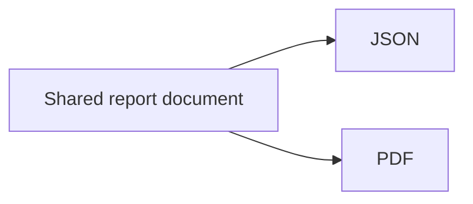
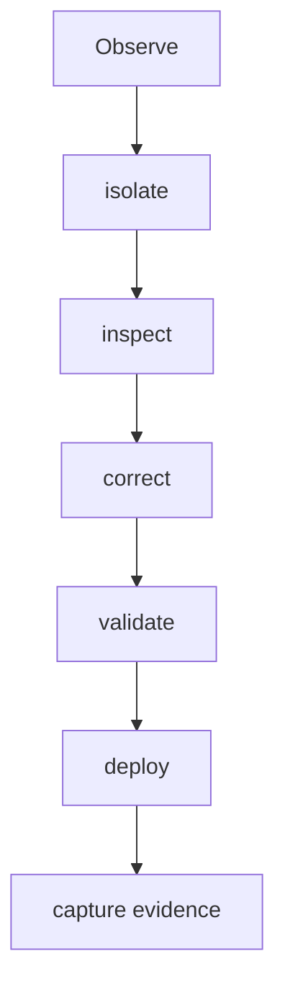

# Lab 12C - Compliance Evidence Agent

## **Armageddon #2 · SEIR Foundations · Phase 2**

## 1. Lab Purpose and Objectives

Lab 12C extends the security workflow developed in Labs 12, 12A, and 12B by adding a Compliance Evidence Agent.

The Compliance Evidence Agent evaluates configured security controls against observable AWS evidence, records the results in DynamoDB, calculates a deterministic compliance score, and produces synchronized PDF and JSON compliance reports.

A core design principle of this implementation is:

> **Python evaluates controls. Amazon Bedrock explains the results.**

Amazon Bedrock does not decide whether a control passes, fails, or requires review. Control evaluation and scoring remain deterministic.

### Objectives

- Load reusable compliance controls from `controls.json`.
- Select controls based on requested compliance frameworks.
- Evaluate controls with deterministic Python validators.
- Preserve one evidence record for every evaluated control.
- Calculate PASS, FAIL, and REVIEW outcomes.
- Calculate a deterministic overall compliance score.
- Optionally use Amazon Bedrock to explain computed results.
- Produce synchronized PDF and JSON compliance reports.
- Store compliance evidence in DynamoDB.
- Publish report artifacts to Amazon S3.
- Record operational activity in Amazon CloudWatch Logs.
- Preserve clear boundaries between evidence, evaluation, explanation, remediation, and certification.

## 2. Custom Badges

Badges may be added here if they are used consistently across the Lab 12 series.

## 3. Lab / Task / Project Overview

Lab 12C adds compliance evidence collection and evaluation to the security workflow established in the preceding labs.

The inherited security workflow is:



The Lab 12C compliance workflow is:



### Post-Submission Security Enhancement: Authentication, RBAC, and Token-Use Telemetry

After completing the original Lab 12C Compliance Evidence Agent, the environment was extended with an additional identity, authorization, and security-telemetry layer.

This enhancement adds:

- Amazon Cognito authentication
- TOTP multifactor authentication
- API Gateway Cognito authorization
- Cognito group-based role-based access control
- application-level authorization in Lambda
- DynamoDB token-use telemetry
- token ownership verification
- unused-token detection
- EventBridge Scheduler integration
- structured CloudWatch logging

The enhancement preserves the original Lab 12C compliance workflow and extends the existing protected API rather than replacing it.

The resulting protected request path is:



The authorization model deliberately separates authentication from authorization:

| Request | Validated Result | Enforcement Point |
|---|---:|---|
| No valid Cognito token | `401` | API Gateway / Cognito |
| `security-viewers` | `403` | Protected Lambda |
| `security-analysts` | `200` | Protected Lambda |
| `security-admins` | `200` | Protected Lambda |

Additional live validation confirmed:

| Control | Validated Result |
|---|---|
| Missing `x-token-id` | `400` |
| Valid analyst-owned token | `200` |
| Valid admin-owned token | `200` |
| Wrong-owner token | `403` |
| Successful token-use update | `used=false -> used=true` |
| Unused-token detector | `UNUSED_TOKEN` |
| CloudWatch alert logging | Validated |

The token-use telemetry layer does not replace JWT validation and does not determine whether a JWT is expired. It records whether an issued token/session identifier is subsequently used and detects unused records that remain outstanding beyond the configured threshold.

Detailed deployment, IAM, RBAC, token-ownership, detector, validation, and teardown procedures are documented in:

```text
runbooks/lab-12c-authentication-rbac-token-telemetry-runbook.md
```

Current enhancement status:

```text
Infrastructure deployment: COMPLETE
Cognito infrastructure: VALIDATED
Cognito MFA: VALIDATED
Live Cognito authentication: VALIDATED
Live RBAC authorization: VALIDATED
Token-use telemetry: VALIDATED
Token ownership validation: VALIDATED
Unused-token detection: VALIDATED
CloudWatch alert logging: VALIDATED
Final Terraform no-drift validation: VALIDATED
Infrastructure teardown: COMPLETE
Terraform post-destroy state: EMPTY (0 resources)
AWS post-destroy verification: VALIDATED
Final lifecycle status: COMPLETE
```

### Compliance Boundary

The Compliance Agent may:

- read approved AWS resources for compliance evidence
- describe and scan configured DynamoDB tables
- inspect the configured S3 executive-report prefix
- evaluate controls using deterministic validators
- write compliance evidence records
- calculate PASS, FAIL, and REVIEW results
- calculate the overall compliance score
- invoke Amazon Bedrock for narrative explanation
- generate PDF and JSON reports
- publish report artifacts to Amazon S3
- write logs to CloudWatch

The Compliance Agent does not:

- claim organizational certification
- claim that an audit has been passed
- declare the environment secure
- allow Bedrock to determine compliance status
- automatically remediate failed controls
- modify WAF rules
- disable users or credentials
- perform containment
- modify production resources because of a compliance result

The agent reports only what the available evidence supports.

### Control Library

Compliance rules are stored outside the Python evaluation engine in:

```text
json/controls.json
```

The validated implementation contains four controls:

| Control | Purpose | Validator |
| ---------- | ------------------ | -------------- |
| `CTRL-001` | AWS WAF protection | `table_exists` |
| `CTRL-002` | Threat correlation | `table_exists` |
| `CTRL-003` | Incident response | `table_exists` |
| `CTRL-004` | Executive reporting | `s3_prefix` |

The control definitions reference environment variables instead of hard-coded AWS resource names.

### Supported Validators

The Compliance Agent implements reusable validators including:

```text
table_exists
table_not_empty
minimum_records
s3_prefix
```

The Lab 12C control library currently uses:

```text
table_exists
s3_prefix
```

A control that cannot be evaluated must not silently pass. The configured fallback state is:

```text
UNEVALUATED_STATUS=REVIEW
```

### Framework Selection

The validation event requests:

```json
{
  "frameworks": [
    "NIST CSF 2.0",
    "CIS Controls v8"
  ]
}
```

Controls are selected when their framework mappings match at least one requested framework.

### Evidence Model

Each evaluated control generates a separate evidence record in DynamoDB.

Evidence is written immediately after control evaluation so partial progress is preserved even if report generation later fails.

Evidence records are not overwritten between executions. Each execution receives new evidence identifiers.

Validated testing produced:

```text
Deterministic execution:
4 controls evaluated
4 evidence records written

Bedrock-enabled execution:
4 controls evaluated
4 additional evidence records written

Final evidence count:
8 records
```

### Compliance Scoring

PASS, FAIL, and REVIEW are calculated by Python.

Validated deterministic execution produced:

```text
overall_status: PASS
score_percent: 100.0
controls_evaluated: 4
evidence_records_written: 4
bedrock_used: false
```

Amazon Bedrock does not calculate the compliance status or score.

### Compliance Reports

The Compliance Agent creates one shared report document and renders both:



The PDF supports human review.

The JSON document supports automation, analytics, and future agent workflows.

Artifacts are stored beneath:

```text
compliance-reports/YYYY/MM/DD/
```

with separate `pdf/` and `json/` paths.

## 4. Lab / Task / Project Requirements

### Required Tools

- AWS CLI
- Terraform
- Python 3
- Git
- access to the required AWS services

### AWS Services Used

- AWS Lambda
- Amazon DynamoDB
- Amazon S3
- Amazon CloudWatch Logs
- Amazon Bedrock
- API Gateway
- AWS WAF
- Amazon EventBridge
- Amazon SNS

Lab 12C also reuses the ReportLab Lambda layer introduced in Lab 12B.

## 5. Project / Folder Structure

```text
lab12c/
├── evidence/
├── json/
│   ├── compliance_test_event.json
│   └── controls.json
├── lambda/
│   ├── compliance.py
│   └── requirements.txt
├── runbooks/
│   └── lab-12c-compliance-evidence-runbook.md
├── scripts/
├── src/
├── terraform/
├── test-events/
├── install.md
├── playbook.md
└── README.md
```

The operational runbook contains the detailed deployment, validation, troubleshooting, and teardown procedures:

```text
runbooks/lab-12c-compliance-evidence-runbook.md
```

## 6. Steps Used to Complete This Lab

1. Reviewed the inherited Lab 12 through Lab 12B security workflow.
2. Added the reusable compliance control library.
3. Implemented deterministic Python validators.
4. Added framework-based control selection.
5. Added DynamoDB compliance-evidence persistence.
6. Added deterministic compliance scoring.
7. Added synchronized JSON and PDF report generation.
8. Integrated the existing ReportLab Lambda layer.
9. Added optional Amazon Bedrock narrative explanation.
10. Added Terraform resources and IAM permissions for the Compliance Agent.
11. Corrected an IAM policy error discovered during Terraform validation.
12. Deployed and validated the Compliance Agent.
13. Verified DynamoDB evidence creation.
14. Verified S3 compliance-report generation.
15. Verified CloudWatch logging.
16. Enabled and validated the optional Bedrock path.
17. Verified accumulated evidence across multiple runs.
18. Performed no-drift validation.
19. Created and reviewed the Terraform destroy plan.
20. Destroyed the lab infrastructure.
21. Verified zero remaining managed resources.

## 7. Artifacts / Screenshots - SHOW YOUR WORK

Validation screenshots are stored in `assets/images/members/jacques-payne/phase-2/lab12c/evidence/` at the repository root. The local `evidence/` directory retains the text, PDF, and JSON artifacts.

Evidence includes:

- Terraform validation
- troubleshooting of the original Terraform/IAM error
- corrected Terraform plan
- Terraform deployment
- Compliance Agent Lambda configuration
- DynamoDB compliance-evidence table
- executive-report prerequisite validation
- S3 executive-report evidence
- Compliance Agent invocation
- generated compliance reports in S3
- DynamoDB evidence count and evidence records
- CloudWatch logs
- Bedrock enablement plan and apply
- Bedrock-enabled Compliance Agent validation
- evidence accumulation after the Bedrock-enabled run
- Terraform no-drift validation
- destroy plan
- successful Terraform destroy
- empty post-destroy Terraform state
- post-destroy AWS resource verification

### Authentication and Cleanup Examples

These historical captures accompany the authentication, RBAC and token-use checks described above. Follow the role and expected response in each row; IDs belong to the original run. The final frames continue into teardown.

| Capture | Expected result or context |
| --- | --- |
| [lab12c-25-auth-10-no-token-401.png](../../../../assets/images/members/jacques-payne/phase-2/lab12c/evidence/lab12c-25-auth-10-no-token-401.png) | Anonymous request is rejected with 401. |
| [lab12c-26-auth-11-viewer-user-rbac-verify.png](../../../../assets/images/members/jacques-payne/phase-2/lab12c/evidence/lab12c-26-auth-11-viewer-user-rbac-verify.png) | Viewer membership readback establishes the role being tested. |
| [lab12c-27-auth-12-viewer-mfa-setup-challenge.png](../../../../assets/images/members/jacques-payne/phase-2/lab12c/evidence/lab12c-27-auth-12-viewer-mfa-setup-challenge.png) | Viewer sign-in requests MFA enrollment. |
| [lab12c-28-auth-13-viewer-mfa-enrollment-complete.png](../../../../assets/images/members/jacques-payne/phase-2/lab12c/evidence/lab12c-28-auth-13-viewer-mfa-enrollment-complete.png) | Viewer completes MFA enrollment. |
| [lab12c-29-auth-14-viewer-rbac-403.png](../../../../assets/images/members/jacques-payne/phase-2/lab12c/evidence/lab12c-29-auth-14-viewer-rbac-403.png) | Viewer access is rejected with 403 by RBAC. |
| [lab12c-30-auth-15-analyst-user-rbac-verify.png](../../../../assets/images/members/jacques-payne/phase-2/lab12c/evidence/lab12c-30-auth-15-analyst-user-rbac-verify.png) | Analyst membership readback establishes the role being tested. |
| [lab12c-31-auth-16-analyst-mfa-enrollment-complete.png](../../../../assets/images/members/jacques-payne/phase-2/lab12c/evidence/lab12c-31-auth-16-analyst-mfa-enrollment-complete.png) | Analyst completes MFA enrollment. |
| [lab12c-32-auth-17-analyst-missing-token-id-400.png](../../../../assets/images/members/jacques-payne/phase-2/lab12c/evidence/lab12c-32-auth-17-analyst-missing-token-id-400.png) | A missing token identifier returns 400. |
| [lab12c-33-auth-18-analyst-api-200.png](../../../../assets/images/members/jacques-payne/phase-2/lab12c/evidence/lab12c-33-auth-18-analyst-api-200.png) | Authorized analyst request returns 200. |
| [lab12c-34-auth-19-analyst-token-marked-used.png](../../../../assets/images/members/jacques-payne/phase-2/lab12c/evidence/lab12c-34-auth-19-analyst-token-marked-used.png) | The analyst token is recorded as used. |
| [lab12c-35-auth-20-wrong-owner-403.png](../../../../assets/images/members/jacques-payne/phase-2/lab12c/evidence/lab12c-35-auth-20-wrong-owner-403.png) | A different token owner is rejected with 403. |
| [lab12c-36-auth-21-admin-user-rbac-verify.png](../../../../assets/images/members/jacques-payne/phase-2/lab12c/evidence/lab12c-36-auth-21-admin-user-rbac-verify.png) | Admin membership readback establishes the role being tested. |
| [lab12c-37-auth-22-admin-mfa-enrollment-complete.png](../../../../assets/images/members/jacques-payne/phase-2/lab12c/evidence/lab12c-37-auth-22-admin-mfa-enrollment-complete.png) | Admin completes MFA enrollment. |
| [lab12c-38-auth-23-admin-api-200.png](../../../../assets/images/members/jacques-payne/phase-2/lab12c/evidence/lab12c-38-auth-23-admin-api-200.png) | Authorized admin request returns 200. |
| [lab12c-39-auth-24-admin-token-marked-used.png](../../../../assets/images/members/jacques-payne/phase-2/lab12c/evidence/lab12c-39-auth-24-admin-token-marked-used.png) | The admin token is recorded as used. |
| [lab12c-40-auth-25-unused-token-detector-alert.png](../../../../assets/images/members/jacques-payne/phase-2/lab12c/evidence/lab12c-40-auth-25-unused-token-detector-alert.png) | The detector identifies an unused-token condition. |
| [lab12c-41-auth-26-cloudwatch-unused-token-alert.png](../../../../assets/images/members/jacques-payne/phase-2/lab12c/evidence/lab12c-41-auth-26-cloudwatch-unused-token-alert.png) | CloudWatch shows the unused-token alert. |
| [lab12c-42-auth-27-terraform-no-drift.png](../../../../assets/images/members/jacques-payne/phase-2/lab12c/evidence/lab12c-42-auth-27-terraform-no-drift.png) | Terraform reports no drift before cleanup. |
| [lab12c-43-auth-28-destroy-plan.png](../../../../assets/images/members/jacques-payne/phase-2/lab12c/evidence/lab12c-43-auth-28-destroy-plan.png) | The destroy plan is reviewed before cleanup. |
| [lab12c-44-auth-29-destroy-complete.png](../../../../assets/images/members/jacques-payne/phase-2/lab12c/evidence/lab12c-44-auth-29-destroy-complete.png) | Terraform reports destroy complete. |
| [lab12c-45-auth-30-post-destroy-state-empty.png](../../../../assets/images/members/jacques-payne/phase-2/lab12c/evidence/lab12c-45-auth-30-post-destroy-state-empty.png) | The managed state is empty after teardown. |
| [lab12c-46-auth-31-post-destroy-aws-verify.png](../../../../assets/images/members/jacques-payne/phase-2/lab12c/evidence/lab12c-46-auth-31-post-destroy-aws-verify.png) | The post-destroy AWS check shows the inspected resources. |

## 8. Steps Used to Teardown / Clean Up the Lab

Lab 12C was destroyed using a reviewed Terraform destroy plan.

The teardown process included:

1. Creating the destroy plan.
2. Reviewing the resources scheduled for destruction.
3. Applying the approved destroy plan.
4. Checking Terraform state after destruction.
5. Verifying that matching AWS resources no longer remained.

Local generated files such as Terraform state, saved plans, deployment ZIP archives, local variable files, `.DS_Store`, and cache files are not intended for repository submission.

## 9. Lessons Learned

### Deterministic Decisions Should Remain Deterministic

Generative AI can help explain compliance results, but it should not replace deterministic control evaluation when an objective validator is available.

### Evidence Should Be Preserved During Execution

Writing evidence after every evaluated control protects partial results if a later step fails.

### REVIEW Is Safer Than an Unsupported PASS

A control that cannot be evaluated should not silently pass.

### Compliance Evidence Is Not Certification

Technical evidence can demonstrate observed control conditions without claiming certification, audit success, or organizational compliance.

### Separate Controls From the Evaluation Engine

Keeping framework mappings and control definitions in `controls.json` makes the control library easier to change without rewriting the Python engine.

### Infrastructure Validation Is Part of the Implementation

The IAM `MalformedPolicyDocument` issue demonstrated why Terraform validation, plan review, troubleshooting, and re-validation are part of the engineering process rather than separate activities.

## 10. References

- AWS Lambda documentation
- Amazon DynamoDB documentation
- Amazon S3 documentation
- Amazon CloudWatch documentation
- Amazon Bedrock documentation
- Terraform AWS Provider documentation
- NIST Cybersecurity Framework 2.0
- CIS Controls v8
- ReportLab documentation
- Armageddon / SEIR Foundations Lab 12C source material

See the Lab 12C runbook for detailed operational commands and validation procedures.

## 11. Troubleshooting

### IAM `MalformedPolicyDocument`

During Terraform deployment, the Compliance Agent IAM policy returned:

```text
Policy statement must contain resources
```

The affected policy statement had lost its required `Resource` entries.

The policy was corrected by restoring the required DynamoDB and logging resource references.

After remediation:

```text
terraform fmt
terraform validate
terraform plan
```

completed successfully and the deployment proceeded.

### Troubleshooting Principle

The troubleshooting process followed:



The detailed troubleshooting record is preserved in the Lab 12C runbook and evidence directory.

## 12. Author & Contributors

### Author and Group Leader

Jacques Payne

### Armageddon #2 Group

- Jacques Payne
- Joe Tolliver, Jr.
- Cautchy Bailly
- Kirk Alton

### Collaboration Model

Armageddon #2 was completed as a group project with members maintaining individual branches and work areas.

This Lab 12C implementation and evidence set represent the work maintained in Jacques Payne's project area.

Phase 1 group submission materials were maintained through Kirk Alton's repository.
