# Agent 10 — Domain Models, Trust, Response, and Reporting

> **Purpose:** Agent 10 defines the shared domain language and data contracts used by the Gen2X agent architecture.

---

# 1. Overview

Gen2X contains multiple agents capable of collecting information, evaluating evidence, identifying threats, recommending responses, and communicating results.

Those agents need a common language.

Without one, individual agents may develop different definitions for concepts such as:

```text
Provider
Evidence
Indicator
Threat
Severity
Confidence
Trust
Response
Authorization
Report
Accountability
```

That creates ambiguity.

In security engineering, ambiguity creates risk.

Agent 10 provides the shared domain architecture used to reduce that ambiguity.

Its primary implementation resides in:

```text
models/
```

---

# 2. What Agent 10 Does

Agent 10 defines the structured objects exchanged throughout the Gen2X architecture.

Conceptually:

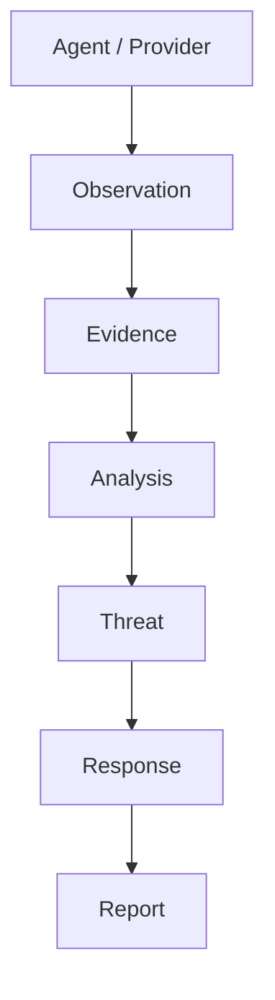

Agent 10 establishes the contracts that describe these concepts.

It answers questions such as:

```text
What does evidence look like?

How is a provider identified?

How is trust represented?

How is threat severity represented?

How is confidence represented?

What does a response recommendation contain?

Who has authority to approve a response?

How is investigation state represented?

What belongs in a security report?

How is accountability preserved?
```

---

# 3. What Agent 10 Does NOT Do

Agent 10 is primarily a **domain-model layer**.

It does not replace the agents and services that perform operational work.

For example:

```text
Provider Agent
    collects observations

EvidenceAggregator
    organizes evidence

Fusion
    analyzes evidence

Threat
    represents the conclusion

Response
    represents the recommendation and governance state

Response Executor
    performs an authorized action

Report Builder
    creates human-facing reporting
```

Agent 10 defines the language these components use.

A useful rule is:

```text
ENUMS
    define the vocabulary

MODELS
    define the contracts

AGENTS
    perform the work
```

---

# 4. Why This Layer Exists

Imagine several security agents operating independently.

One agent produces:

```text
severity = "critical"
```

Another produces:

```text
severity = "CRITICAL"
```

Another produces:

```text
severity = "Crit"
```

Another produces:

```text
severity = 5
```

And another decides:

```text
severity = "really_bad"
```

All five agents may be trying to communicate the same idea.

The system now has five representations of it.

This becomes worse when the concepts are more complicated:

```text
Trust
Confidence
Approval
Investigation State
Execution Authority
Evidence Provenance
```

Agent 10 prevents each agent from inventing its own vocabulary.

---

# 5. Current Folder Structure

The current model architecture is:

```text
models/
│
├── __init__.py
├── base_model.py
│
├── enums/
│   │
│   ├── __init__.py
│   ├── base_enum.py
│   │
│   ├── indicator_enums.py
│   ├── provider_enums.py
│   ├── threat_enums.py
│   ├── report_enums.py
│   ├── response_enums.py
│   ├── cache_enums.py
│   └── platform_enums.py
│
├── indicator.py
├── provider.py
├── evidence.py
├── threat.py
├── response.py
└── report.py
```

Each file has a specific responsibility.

---

# 6. `base_model.py`

`base_model.py` provides shared behavior for Gen2X models.

The project uses Pydantic to support structured model definitions, validation, normalization, serialization, and other common model operations.

Conceptually:

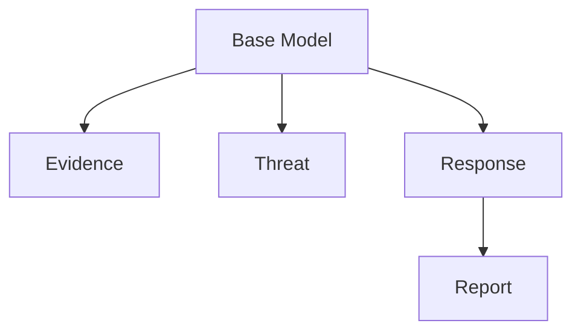

Common behavior belongs here when it genuinely applies across the domain.

The purpose of a base model is not to become a giant collection of convenience functions.

It should provide a stable foundation.

---

# 7. The Enum Layer

The `enums/` directory defines controlled domain vocabulary.

```text
models/enums/
```

This is important because security systems depend heavily on consistent terminology.

Examples include:

```text
ThreatSeverity
ThreatConfidence
ThreatCondition
ResponseAction
ResponsePriority
InvestigationStatus
ApprovalStatus
ExecutionMode
ReportStatus
PlatformTrustLevel
PlatformService
```

Instead of allowing arbitrary strings throughout the system, enums establish accepted vocabulary.

Conceptually:

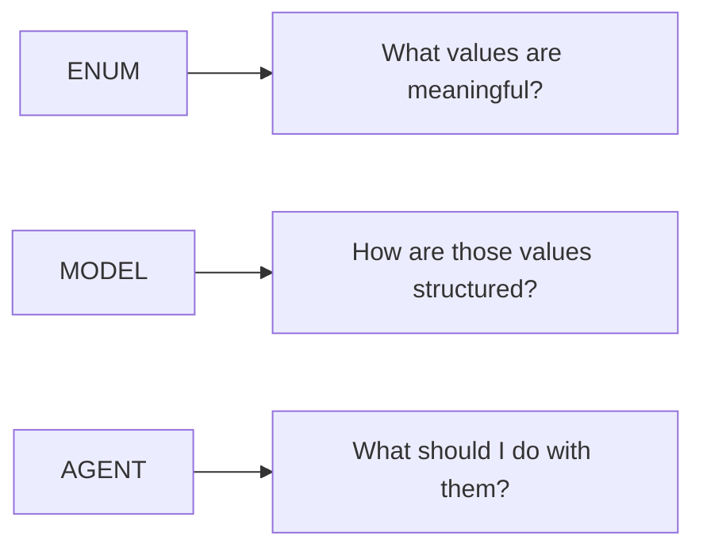

---

# 8. `indicator.py`

`indicator.py` represents what Gen2X is investigating or tracking.

Its fundamental question is:

> **What are we investigating?**

Indicators give the rest of the system something identifiable around which observations and evidence can be organized.

Conceptually:

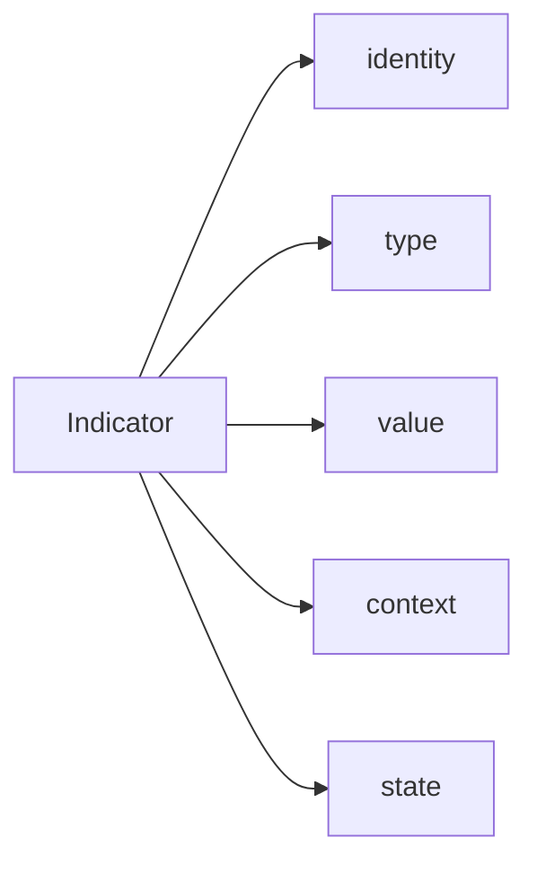

Indicators may eventually be associated with many observations from many providers.

---

# 9. `provider.py`

`provider.py` describes where information originates.

Its fundamental question is:

> **Where did this information come from?**

Examples may include:

```text
AWS
Azure
GCP
GitHub
OnPrem
Security Tools
External APIs
```

Provider information becomes important when evaluating provenance and trust.

Two pieces of evidence containing identical text do not necessarily deserve identical trust.

Their origins matter.

---

# 10. `evidence.py`

`evidence.py` represents security observations that may support later analysis.

Its fundamental question is:

> **What was observed?**

Evidence should preserve enough context to understand the observation and its origin.

Conceptually:

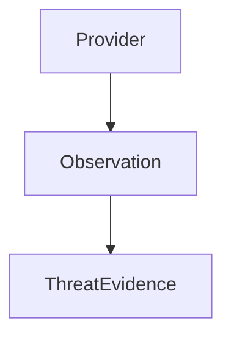

Evidence is not automatically a conclusion.

For example:

```text
Observed:
    A token appears in a public repository.

Conclusion:
    The token represents a confirmed credential exposure.
```

Those are different statements.

The first is evidence.

The second requires analysis.

---

# 11. Evidence Identity

Evidence must be identifiable.

Gen2X uses concepts such as:

```text
evidence_id
observation_key
provider
timestamps
context
```

The `observation_key` helps establish a stable way to identify or correlate observations without forcing other components to understand the internal construction of the evidence model.

This helps components such as `EvidenceAggregator` operate against a clean interface.

---

# 12. Evidence Aggregation

Multiple observations may relate to the same security condition.

Conceptually:

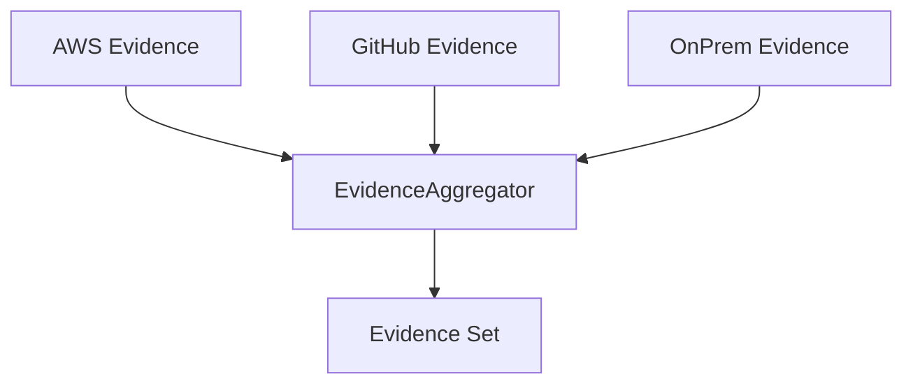

Aggregation does not automatically determine truth.

It organizes evidence so later reasoning can evaluate it.

This distinction matters.

> **Collection is not conclusion.**

---

# 13. `threat.py`

`threat.py` represents the current security conclusion produced from analyzed evidence.

Its fundamental question is:

> **What do we currently believe?**

A threat may contain concepts such as:

```text
ThreatIdentity
ThreatCondition
ThreatSeverity
ThreatConfidence
ThreatAssessment
ThreatContext
ThreatProvenance
```

Conceptually:

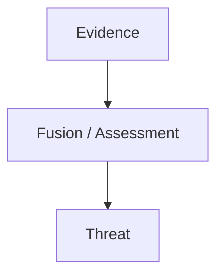

The Threat is a conclusion.

It should still preserve enough provenance to explain why that conclusion exists.

---

# 14. Severity and Confidence Are Different

This distinction is critical.

Consider:

```text
Severity:
    CRITICAL

Confidence:
    LOW
```

This means:

> If the condition is real, its consequences could be critical.

But:

> The available evidence does not yet strongly establish that the conclusion is correct.

Alternatively:

```text
Severity:
    LOW

Confidence:
    HIGH
```

means:

> We are highly confident the condition exists, but its expected impact is relatively small.

Therefore:

```text
Severity
    ≠
Confidence
```

One describes potential consequence.

The other describes certainty in the conclusion.

---

# 15. Trust Is Another Dimension

Trust is also separate from confidence.

Gen2X includes concepts such as:

```text
PlatformTrustLevel
```

Trust asks questions such as:

```text
How much confidence should we place in this source?

What baseline exists?

How well do we understand the platform?

What controls protect it?

What provenance exists?

Has the source earned trust?
```

This is not the same question as threat confidence.

Conceptually:

```text
TRUST
    How much should I trust the source?

CONFIDENCE
    How strongly does the evidence support the conclusion?

SEVERITY
    How serious would the condition be?
```

These should not be collapsed into one value.

---

# 16. `response.py`

`response.py` represents what Gen2X recommends doing after a threat has been assessed.

Its fundamental questions are:

> **What should we do?**

and:

> **Are we authorized to do it?**

The response architecture includes concepts such as:

```text
ResponseIdentity
ResponseTarget
ResponseRecommendation
InvestigationState
ResponseGovernance
Response
```

Conceptually:

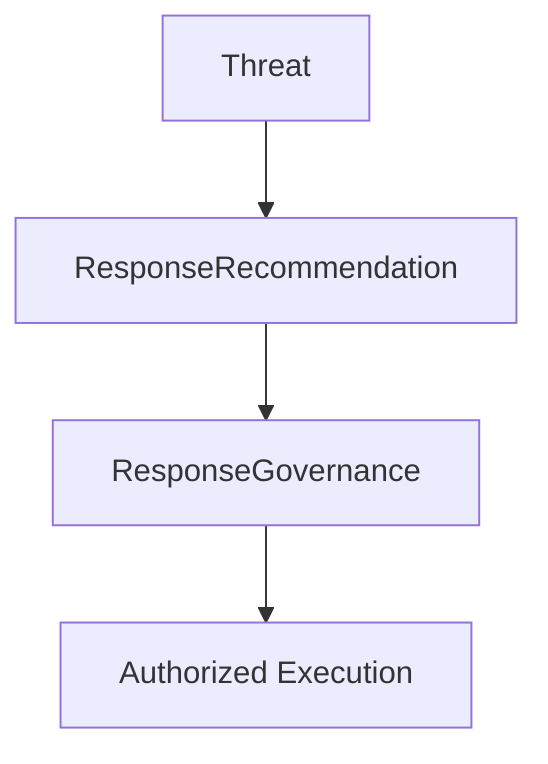

The response model does not itself perform execution.

---

# 17. Recommendation Is Not Execution

A security system may recommend:

```text
DISABLE_ACCOUNT
```

That does not mean the model should immediately disable the account.

Instead:

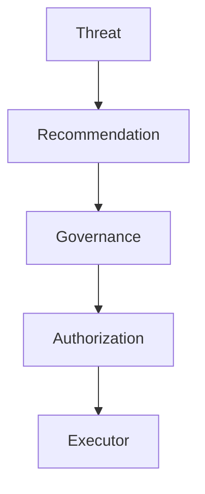

This creates an important security boundary.

> **Knowing what should be done does not automatically grant permission to do it.**

---

# 18. Capability and Authority

This distinction is fundamental to the response architecture.

```text
CAPABILITY
    Can the system perform the action?

AUTHORITY
    Is the system permitted to perform the action?
```

A system may possess credentials capable of disabling an account.

That establishes capability.

It does not automatically establish authority.

In Gen2X:

```text
Credentials
    provide capability

Governance
    establishes authority
```

Both matter.

---

# 19. Investigation State

Security investigations have a lifecycle.

Examples may include:

```text
NEW
TRIAGE
INVESTIGATING
EVIDENCE_COLLECTION
ANALYSIS
RESPONSE_PENDING
RESPONSE_IN_PROGRESS
MONITORING
RESOLVED
CLOSED
REOPENED
```

These states answer:

> **Where are we in the investigation?**

They do not answer:

```text
How severe is the threat?

How confident are we?

Has the response been approved?

Did execution succeed?
```

Those are different dimensions of state.

---

# 20. Resolved Is Not Closed

Gen2X intentionally distinguishes:

```text
RESOLVED
```

from:

```text
CLOSED
```

A security condition may have been remediated while the investigation remains active for:

```text
Monitoring
Verification
Documentation
Review
Administrative closure
```

Therefore:

```text
RESOLVED
    The security condition has been addressed.

CLOSED
    The investigation itself is complete.
```

That distinction preserves operational reality.

---

# 21. `report.py`

`report.py` represents the human-facing security record.

Its fundamental questions are:

> **What do humans need to know?**

and:

> **Who is accountable?**

The report architecture includes:

```text
ReportIdentity
ReportAudience
ExecutiveSummary
ThreatSummary
ResponseSummary
ReportFinding
ReportEvidenceSummary
ReportAccountability
Report
```

Conceptually:

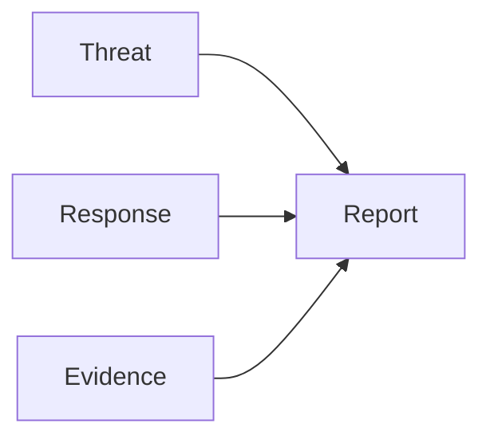

---

# 22. Executive Summary

Humans have different information requirements.

Engineers may want:

```text
Evidence IDs
Provider details
Timestamps
Confidence
Resource identifiers
Correlation
Raw observations
```

Leadership frequently wants:

```text
What happened?

How serious is it?

What is affected?

What are we doing?

Do you need a decision from me?
```

The `ExecutiveSummary` provides that concise view.

Conceptually:

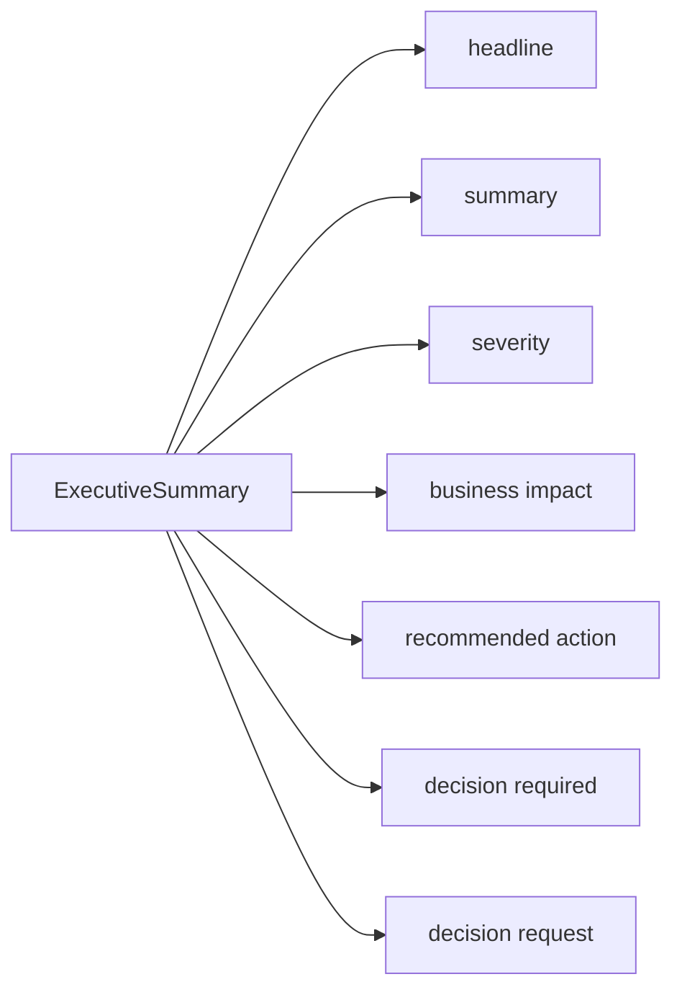

The executive summary changes presentation.

It must not change facts.

---

# 23. Different Audience, Same Facts

Gen2X may eventually produce several views of the same security event.

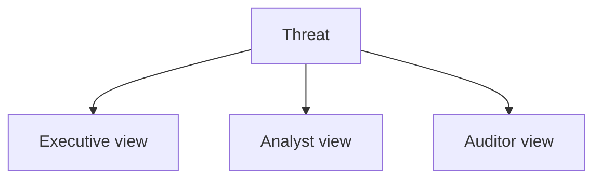

The amount and presentation of information may change.

The underlying facts should not.

Therefore:

> **Different audience does not mean different truth.**

---

# 24. Report Findings

A report may contain multiple findings.

For example:

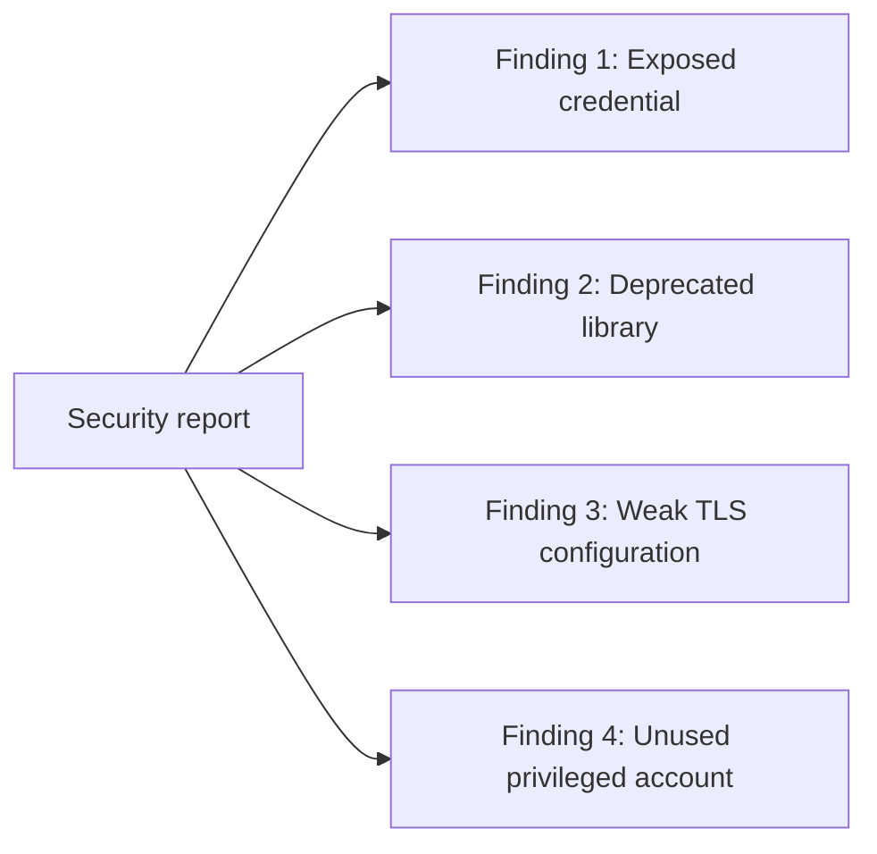

This allows reports to represent realistic security investigations rather than forcing:

```text
one report = one finding
```

---

# 25. Evidence Summary

Reports should preserve evidence traceability without necessarily dumping every complete evidence object into a human-facing document.

A report may therefore contain an evidence summary such as:

```text
Evidence Count
Provider Count
Provider Names
Evidence IDs
Corroboration State
Conflict State
```

Detailed evidence remains available in the evidence domain.

The report provides the path back to it.

---

# 26. Multiple Sources Do Not Automatically Mean Corroboration

This distinction is important.

Suppose three providers report the same information.

That does not automatically prove that three independent observations exist.

They may all rely on the same upstream source.

Therefore:

```text
provider_count > 1
```

does not automatically imply:

```text
corroborated = True
```

Provider quantity is a fact.

Corroboration is an analytical conclusion.

---

# 27. Accountability

Security decisions should be attributable.

A report should help answer questions such as:

```text
Who owned the investigation?

Who created the recommendation?

Was approval required?

Who approved it?

Who rejected it?

When was the decision made?

Why was the decision made?

Who or what generated the report?
```

This is the purpose of:

```text
ReportAccountability
```

Accountability is not decorative metadata.

It is part of the security record.

---

# 28. Unknown Is Better Than Fabricated

Sometimes accountability information will be incomplete.

For example:

```text
approved_by = None
```

That may be undesirable.

But it is honest.

The system should not silently replace missing attribution with something convenient such as:

```text
approved_by = "security_team"
```

unless that fact is actually established.

Therefore:

> **Unknown accountability is a finding.**

> **Fabricated accountability is a failure.**

---

# 29. Report Lifecycle

Reports follow a lifecycle.

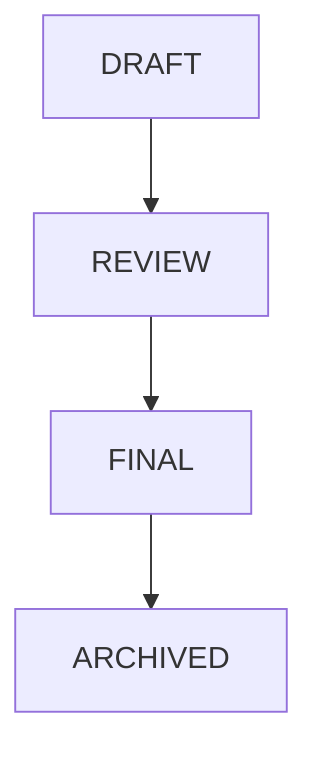

During `DRAFT`, the report may change.

During `REVIEW`, errors may be discovered and corrected.

Once `FINAL`, the report represents a historical record.

---

# 30. Do Not Rewrite Final Reports

Humans make mistakes.

Analysts make mistakes.

Engineers make mistakes.

Automated systems make mistakes.

A finalized report may eventually prove incorrect.

The solution should not be to silently rewrite history.

Instead:

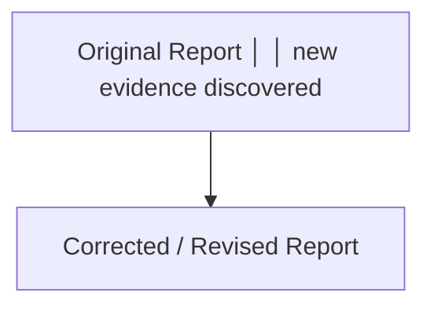

Eventually this may become explicit revision lineage:

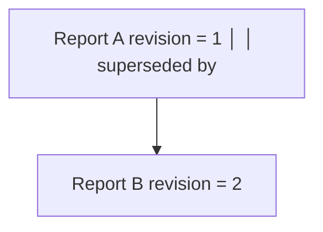

The original remains part of the historical record.

---

# 31. Why Preserve Incorrect Historical Conclusions?

Suppose an investigation originally concluded:

```text
Severity:
    HIGH
```

Later evidence establishes:

```text
Severity:
    CRITICAL
```

Changing the original report makes it appear that the organization always knew the condition was critical.

That is historically inaccurate.

Instead preserve:

```text
TIME 1

Evidence Available:
    A, B

Conclusion:
    HIGH
```

Then:

```text
TIME 2

New Evidence:
    C, D

Revised Conclusion:
    CRITICAL
```

Now the organization can explain how its understanding changed.

That is accountability.

---

# 32. The Complete Domain Flow

The current architecture can be understood as:

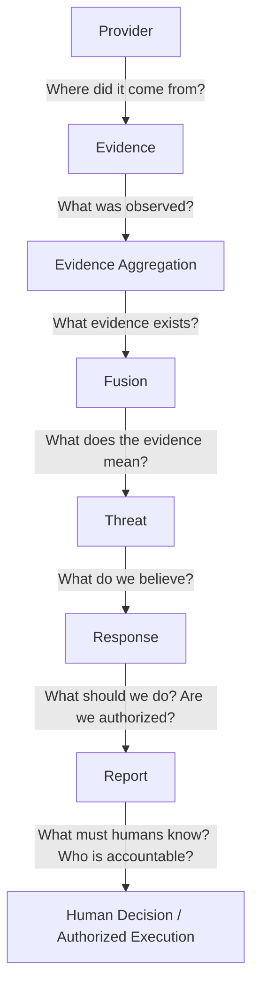

This flow intentionally separates observation, reasoning, recommendation, authority, and communication.

---

# 33. Four Cross-Cutting Security Concepts

Four concepts now appear throughout Agent 10.

They should remain distinct.

## Trust

```text
Should I trust the source?
```

Trust should be earned through evidence and baseline.

---

## Provenance

```text
Where did this information come from?
```

Without provenance, evidence becomes harder to evaluate.

---

## Authority

```text
Who is permitted to perform this action?
```

Capability does not imply authority.

---

## Accountability

```text
Who made the decision, and why?
```

Security decisions should survive later examination.

---

# 34. The Trust Chain

One way to visualize Agent 10 is as a sequence of trust boundaries:

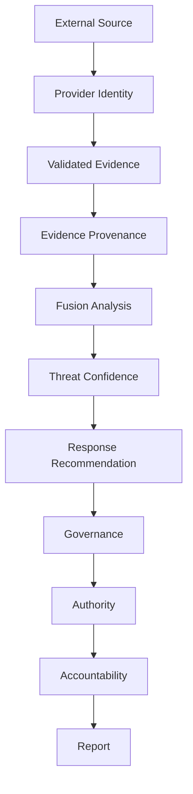

Each boundary asks a different question.

No single answer replaces all the others.

---

# 35. Pydantic's Role

Pydantic is used throughout the model architecture to help provide:

```text
Structured data
Runtime validation
Normalization
Enum validation
Nested models
Serialization
Assignment validation
Error visibility
```

But remember:

```text
Pydantic Validation
        ≠
Trust
```

Pydantic can establish that data conforms to a model.

It cannot establish that the data is true.

See the separate Pydantic reference document for a more detailed explanation.

---

# 36. Agent 10 and Other Agents

Operational agents should consume and produce Agent 10 models rather than inventing their own domain structures whenever practical.

For example:

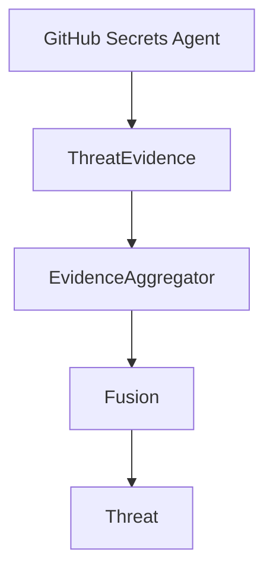

Another provider may use the same contract:

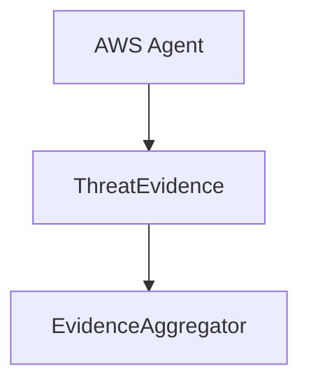

And another:

```mermaid
flowchart TD
    N0["OnPrem Agent"] --> N1
    N1["ThreatEvidence"]
```

The providers differ.

The contract remains understandable.

---

# 37. Why This Matters as Gen2X Grows

A small system can survive informal contracts.

A larger agent system cannot.

Imagine:

```text
10 Agents
20 Providers
50 Threat Conditions
Multiple Cloud Platforms
GitHub
OnPrem
LLM Analysis
Automated Response
Human Approval
Executive Reporting
Audit Requirements
```

Without shared models, every integration becomes a translation problem.

With shared models:

```mermaid
flowchart TD
    N0["Agent A"] --> N1
    N1["Common Contract"] --> N2
    N2["Agent B"]
```

This reduces coupling and makes future expansion easier.

---

# 38. What Students Should Learn From Agent 10

Do not memorize every class.

Do not memorize every Pydantic method.

Do not memorize every enum.

Understand the boundaries.

When reading a model, ask:

```text
What does this represent?

Who creates it?

Who consumes it?

What does it know?

What should it NOT know?

What does it validate?

What does it trust?

What remains unknown?
```

Those questions are more important than syntax.

---

# 39. Security Architecture Is About Boundaries

Many security failures occur because boundaries become unclear.

For example:

```text
Observation
    accidentally becomes conclusion.

Recommendation
    accidentally becomes execution.

Capability
    accidentally becomes authority.

Summary
    accidentally becomes truth.

Missing attribution
    accidentally becomes assumed attribution.
```

Agent 10 attempts to make those boundaries explicit.

```text
OBSERVATION
      ≠
CONCLUSION

CONCLUSION
      ≠
RECOMMENDATION

RECOMMENDATION
      ≠
AUTHORIZATION

AUTHORIZATION
      ≠
EXECUTION

EXECUTION
      ≠
VERIFICATION

SUMMARY
      ≠
SOURCE OF TRUTH
```

If you remember one section of this document, remember this one.

---

# 40. Final Architectural Principle

Agent 10 exists because intelligent agents still require disciplined architecture.

An agent may reason.

An agent may recommend.

An agent may summarize.

An agent may eventually act.

But every one of those operations should occur inside explicit boundaries.

Gen2X therefore attempts to preserve:

```text
Evidence
    before conclusion.

Provenance
    before trust.

Confidence
    with conclusions.

Authority
    before action.

Accountability
    after decisions.

History
    after publication.
```

The objective is not merely to build software that can make decisions.

The objective is to build software that can explain:

```text
What did we observe?

Where did it come from?

Why did we believe it?

How confident were we?

What did we recommend?

Who had authority?

Who made the decision?

What did we tell humans?

What did we know at that time?
```

That is the foundation of an accountable security system.

---

# Chewbacca's Commentary 🐾

Ten agents

walk into

a security architecture.

Every agent

is intelligent.

Every agent

has an opinion.

Every agent

has data.

And every agent

calls

the same thing

something different.

Congratulations.

You have not

built

artificial intelligence.

You have built

a committee.

Agent 10

exists

because intelligence

without

a common language

creates

confusion.

But language

alone

is not enough.

Evidence

must preserve

where it came from.

Conclusions

must preserve

why they exist.

Recommendations

must remain

recommendations.

Authority

must be

granted.

Actions

must be

attributable.

Reports

must preserve

what humans

knew

when they

made decisions.

And trust...

trust should

never appear

simply because

someone

showed up

with credentials.

Keys

demonstrate

capability.

They do not

prove

authority.

Data

demonstrates

observation.

It does not

prove

truth.

Confidence

describes

belief.

It does not

create

certainty.

And a report

describes

what we knew.

It should not

rewrite

what we knew

after history

became

more convenient.

Build systems

that can

change their minds.

But build them

so they remember

why.

That is

not merely

good software.

That is

accountable

engineering.

And if

ten agents

still cannot

agree

on the enum...

remove

their Porg Sushi

until

the integration

tests pass.

— Chewbacca  
Chief Wookiee Architect  
Agent 10 Architecture Review Board  
Keeper of Trust Boundaries  
Porg Sushi Compliance & Enforcement
