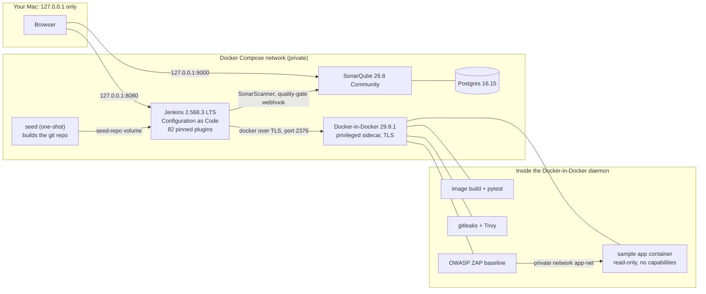

# Local DevSecOps Pipeline with Jenkins, SonarQube, Trivy and OWASP ZAP


A Jenkins pipeline, configured as code, that builds a small Flask app, tests it, scans it six ways (code quality, secrets, dependencies, the image, the Terraform and, once it is deployed to a local container, the running app with OWASP ZAP). It all runs in Docker on one laptop and costs nothing. One run fails on purpose to show that a gate blocks a vulnerable dependency, and the next run, on the fixed code, passed on 2026-10-03. A rerun on 2026-10-04 stopped at the image scan on a base-image package finding (see [Evidence](#evidence)), so the result depends on the date.

> **Scope:** This is a local lab, not a production setup. It runs on one machine, builds one small sample app, uses plain HTTP on `127.0.0.1` and, by default, has no cloud account behind it. Two optional stages (Snyk and a Jira ticket on failure, off by default) do talk to those two services. See [Scope and limitations](#scope-and-limitations).

## At a glance

| | |
| --- | --- |
| **Problem** | A pipeline that only builds and deploys proves little. I wanted one that blocks insecure code, shows that it blocks it, and leaves nothing running or lying around afterwards. |
| **Solution** | Docker Compose runs Jenkins (configured as code, 82 plugins pinned and baked into the image), SonarQube with Postgres, and an isolated Docker-in-Docker sidecar. A 12-stage pipeline builds, tests, runs SonarQube with a strict quality gate, gitleaks and three Trivy scans, deploys the app to a hardened container and runs a ZAP baseline scan against it. |
| **Environment** | MacBook Pro (Apple M3 Pro), Docker Desktop, everything bound to `127.0.0.1`. Every image is pinned to an exact version, with no `:latest`. |
| **Proof** | Run 1 on a branch with known-vulnerable dependencies was stopped by Trivy with 5 HIGH findings. Run 2 on the fixed code passed all 12 stages on 2026-10-03: 16 of 16 tests, 100% coverage, a strict SonarQube gate, no secrets, no HIGH or CRITICAL findings, and a ZAP baseline with 0 failures and 0 warnings. Teardown left no containers, volumes or project images. A later run with the optional Snyk and Jira stages on stopped on `main` at `Trivy: image` because of a Debian package in the base image; the details are [below](#optional-snyk-and-jira-run-2026-10-04). |
| **Hardest problem** | Ten failures along the way, from a SonarQube password policy to a quality gate that said "OK" next to an open critical issue. The gate was the most useful one to find: [the full list](evidence/what-failed-and-how-i-fixed-it.md). |
| **Cost** | $0. By default there is no cloud account, no cloud credential and no cloud stage. The optional Snyk and Jira stages use free-tier accounts and API tokens kept in 1Password. |
| **Skills shown** | Jenkins pipelines and Configuration as Code, Docker Compose, Docker-in-Docker isolation, SonarQube quality gates, Trivy, gitleaks, OWASP ZAP, pinning and supply-chain hygiene, secrets handling, negative testing, evidence-based documentation |

## Interview talk track

**Recruiter or hiring manager (30 seconds)**
"I built a security pipeline that runs entirely on my laptop. It builds a small app, tests it, scans the code, the dependencies, the container image and the Terraform, then deploys the app and attacks it with a web scanner. I also made it fail on purpose with a vulnerable dependency to show the gate works, and I kept a log of every mistake I made along the way."

**Security engineer or CISO**
"The first thing I changed from the course exercise was where the trust sits. Jenkins talks to a separate Docker-in-Docker daemon over TLS, not to my laptop's Docker, so a bad build cannot reach the host through the socket. Every port is on loopback, every image and plugin is pinned, and the passwords are generated at start and never written into the repository. The most useful bug I found was in my own gate: SonarQube said OK while it listed a critical issue, because the default gate only looks at new code. I replaced it with one on overall code and recorded my review of that finding."

**Platform or DevOps engineer**
"Jenkins is configured as code, including the job and the SonarQube connection, and the plugins are baked into the image at pinned versions, so a clean start takes about a minute with cached images. The workspace is mounted at the same path in Jenkins and in the Docker-in-Docker daemon, which is the trick that makes bind mounts work across the two. Teardown is one script that removes containers, volumes, networks, images and build cache, and I checked it with separate commands."

## Contents

- [What this project demonstrates](#what-this-project-demonstrates)
- [Architecture](#architecture)
- [The pipeline](#the-pipeline)
- [Security decisions](#security-decisions)
- [Quick start](#quick-start)
- [Validate it works](#validate-it-works)
- [Evidence](#evidence)
- [What failed and how I fixed it](#what-failed-and-how-i-fixed-it)
- [Project origin and credits](#project-origin-and-credits)
- [Scope and limitations](#scope-and-limitations)
- [Repository layout](#repository-layout)

## What this project demonstrates

- **A pipeline that gates, and proof that it gates.** The failing run is part of the evidence, not an afterthought.
- **Six scans, each aimed at the right thing:** code quality and security rules (SonarQube), committed secrets (gitleaks), dependencies, the built image and the Terraform (three Trivy scans), and the running application (ZAP).
- **Isolation by design.** Docker-in-Docker over TLS instead of the host Docker socket, loopback-only ports, no cloud credential anywhere.
- **Reproducibility.** Configuration as code, pinned plugins and images, one script up and one script down.
- **Honest reporting.** Where a result was weaker than it looked, this README says so.

## Architecture



How a run works:

1. `scripts/up.sh` generates the passwords, starts Postgres and SonarQube, creates the SonarQube project, a strict quality gate, an analysis token and the webhook, then builds and starts Jenkins and the Docker-in-Docker sidecar.
2. A one-shot `seed` container builds a throwaway git repository from this folder, with two branches: `main` (clean) and `vulnerable-demo` (the same app with known-vulnerable pins).
3. Jenkins loads its configuration and the job from code, and checks out the chosen branch from the seeded repository.
4. Every `docker` command in the pipeline goes to the Docker-in-Docker daemon. The workspace volume is mounted at the same path in Jenkins and in that daemon, so bind mounts resolve in both.
5. A `post` block always removes the deployed container, its network and the images, even when a stage fails.

## The pipeline

| # | Stage | Tool (pinned) | What it checks | Fails the build when |
| --- | --- | --- | --- | --- |
| 1 | Checkout | Git plugin | The seeded repository, on the chosen branch | The checkout fails |
| 2 | Build image | Docker buildx | A multi-stage Dockerfile builds a non-root runtime image and a test image | The build fails |
| 3 | Unit tests | pytest 9.1.1, pytest-cov 7.1.0 | 16 tests; writes JUnit and coverage reports | Any test fails |
| 4 | SonarQube analysis | SonarScanner 8.1.0.6389, SonarQube 26.8.0.126808 Community | Code quality and security rules | The scanner errors |
| 5 | Quality gate | `waitForQualityGate` through a webhook | The custom `strict-overall` gate (below) | The gate is not OK |
| 6 | Secret scan | gitleaks v8.30.1 | The working tree | Any secret is found |
| 7 | Trivy: filesystem | Trivy 0.74.0 | Pinned dependencies and secrets; HIGH and CRITICAL, fixable only | Any finding |
| 8 | Trivy: image | Trivy 0.74.0 | The built image's Debian and Python packages; HIGH and CRITICAL, fixable only | Any finding |
| 9 | Trivy: Terraform | Trivy 0.74.0 | The S3 Terraform in `terraform/`; HIGH and CRITICAL | Any finding |
| 10 | Deploy to a local container | Docker | Runs the image read-only with all capabilities dropped and `no-new-privileges`, then waits for its health check | It is not healthy in 60 seconds |
| 11 | OWASP ZAP baseline | ZAP 2.17.0 | A passive scan of that container over a private network, with three header rules set to FAIL (`zap-rules.conf`) | A rule set to FAIL triggers |
| 12 | Publish reports | HTML Publisher, archive | The ZAP report and every scanner report | Not a gate |

**Optional: Snyk and a Jira ticket (off by default).** The job has a `RUN_SNYK_JIRA` checkbox that defaults to off, and with it off the pipeline is exactly the 12 stages above. When it is on and the stack was started with the secrets (see [Optional: Snyk and Jira](#optional-snyk-and-jira)):

- A **Snyk dependency scan** runs straight after the unit tests, before SonarQube and Trivy, so its gate is exercised even on a branch that Trivy would also block. It runs `snyk test --severity-threshold=high` against the app's pinned Python packages, in a Snyk CLI container pinned by digest (CLI 1.1307.4). The packages are installed inside that container first so Snyk can resolve them, and there is no `--skip-unresolved`. It never runs `snyk monitor` or `snyk auth`. Any HIGH or CRITICAL finding, and any scan error, fails the build.
- If the build fails, a **Jira ticket** (issue type Bug) is created with `curl` against the Jira REST API. The ticket holds the job name, branch, build number, the failed stage (each stage records its own name if it fails; if none was recorded the ticket says to see the build log) and a pointer to the archived reports, and no secret, e-mail address or site URL. If the ticket call fails, only the HTTP status and Jira's own error fields (`errorMessages` and `errors`) are logged, and the build result is unchanged.

The strict quality gate, `strict-overall`, is SonarQube's recommended new-code conditions plus three conditions I added on **overall** code: no open issues, coverage of at least 80%, and every security hotspot reviewed ([screenshot](evidence/screenshots/04-sonarqube-strict-quality-gate.png)).

The Terraform is a scan target only. This project never runs `terraform init`, `plan` or `apply`, and there is no AWS stage.

## Security decisions

| Decision | Why |
| --- | --- |
| **Isolated Docker-in-Docker instead of the host Docker socket.** | Mounting `/var/run/docker.sock` gives a build root-equivalent control of the host's Docker. Here Jenkins reaches a separate daemon over TLS. |
| **That sidecar is `privileged`, and I say so.** | Docker-in-Docker needs it. It is root-equivalent inside Docker Desktop's Linux VM, not directly on macOS, but a build that escapes the inner daemon would still reach that VM. Do not run this on a shared machine. |
| **Every published port is bound to `127.0.0.1`.** | Only Jenkins (8080) and SonarQube (9000) are published. The Docker daemon and Postgres have no host ports. See [`stack-isolation-check.txt`](evidence/stack-isolation-check.txt). |
| **Everything is pinned.** | 5 service images, 4 tool images, 82 Jenkins plugins, the SonarScanner (checked against its published SHA-256) and every Python package. Nothing uses `:latest`. |
| **Passwords are generated at start and never written to the repository.** | `up.sh` creates them, passes them to Compose as environment variables and prints them once. An optional `CREDENTIALS_OUT` file is refused if it is inside the repository. |
| **No cloud credential by default.** | There is nothing to leak and nothing to bill. The optional Snyk and Jira stages use API tokens from 1Password, delivered as Compose secrets (see above). |
| **The deployed app container is hardened.** | Non-root user, read-only filesystem, all capabilities dropped, `no-new-privileges`, a health check, and security headers that ZAP checks. |
| **Anonymous access to Jenkins is off.** | `jenkins.yaml` sets `allowAnonymousRead: false` and keeps CSRF protection on. I saw an anonymous request get HTTP 403 while building the stack; that check is not captured in the evidence folder. |
| **A reviewed SonarQube exclusion, written down.** | Rule `python:S4502` (CSRF) fires on the Flask app. Every route is a GET, so it does not apply, and the exclusion in `sonar-project.properties` says why and when to revisit it. |

## Quick start

Prerequisites: Docker Desktop (Compose v2), `curl` and `openssl`. Plan for about 11 GB of space inside Docker's disk image while the stack is up and about 3.5 GB of RAM for the containers.

```bash
cd projects/06-jenkins-devsecops-ci-cd-pipeline

# 1. Start everything. Passwords are generated and printed once.
./scripts/up.sh

# 2. Open Jenkins at http://127.0.0.1:8080 (user: admin), job "sample-app-devsecops",
#    "Build with Parameters":
#      BRANCH=vulnerable-demo   a gate blocks it (Trivy, 5 HIGH findings)
#      BRANCH=main              passed all 12 stages on 2026-10-03; it can fail later if a scanner
#                               finds something new (see Evidence)
#    SonarQube is at http://127.0.0.1:9000 (user: admin).

# 3. Tear everything down: containers, volumes, networks, images and build cache.
./scripts/down.sh
```

To collect evidence from a finished build, with the passwords from step 1 (use a new label each time: the script overwrites files in an existing label's folder):

```bash
JENKINS_ADMIN_PASSWORD=... SONAR_ADMIN_PASSWORD=... \
  ./scripts/collect-evidence.sh 2 my-run-label evidence
```

`down.sh` clears all BuildKit cache on this Docker daemon. Set `PRUNE_BUILD_CACHE=0` to keep it.

### Optional: Snyk and Jira

How to enable it. You need the 1Password CLI (`op`) signed in, and two items in a vault named `Personal` (edit the vault name in [`jenkins/.env.op`](jenkins/.env.op) if yours differs):

| Item | Fields used |
| --- | --- |
| `jenkins-demo-snyk` | `credential` (a Snyk token) and `org` |
| `jenkins-demo-atlassian` | `credential` (a Jira API token), `email`, `site_url` and `project_key` |

```bash
cd projects/06-jenkins-devsecops-ci-cd-pipeline
op run --env-file=jenkins/.env.op -- ./scripts/up.sh
```

Then tick `RUN_SNYK_JIRA` under "Build with Parameters". `jenkins/.env.op` is committed because it holds only `op://` pointers, never values. Started any other way (plain `./scripts/up.sh`), the lab behaves exactly as described above and the checkbox does nothing useful: a build with it ticked fails at the Snyk stage with a message saying so.

How the values are kept out of the repository and the logs:

- They live only in 1Password. `op run` hands them to `up.sh` as environment variables for that one command, and `up.sh` never prints or writes them. If only some of the six are set, it stops and names the missing ones.
- Docker Compose passes them to Jenkins as **secrets** (read-only files under `/run/secrets` in the Jenkins container, removed with the container), so they are not container environment variables and `docker inspect` does not show them. Configuration as Code turns them into Jenkins credentials.
- The Jenkinsfile reads them with `withCredentials`, which masks them in the console log, inside `sh` blocks that are single-quoted, start with `set +x` and never put a value on a command line. The Jira call gives its credentials to `curl` on standard input and discards curl's error output.
- `collect-evidence.sh` also masks the values when it runs under `op run`.

Revoke both tokens in Snyk and Atlassian when you have finished.

## Validate it works

| Check | Expected |
| --- | --- |
| `BRANCH=vulnerable-demo` | Fails at `Trivy: filesystem` with 5 HIGH findings; later stages are skipped; teardown still runs |
| `BRANCH=main` | All 12 stages passed on 2026-10-03. This is date-dependent: on 2026-10-04 the image scan found a HIGH issue in a base-image package and stopped the build there. |
| Jenkins job | Exists with a `BRANCH` parameter, created from code |
| Anonymous request to Jenkins | HTTP 403 (observed while building; not captured as evidence) |
| `docker ps` on the host during a run | Only the four Compose containers; no container mounts the host Docker socket |
| After `down.sh` | No containers, volumes, networks or project images left |

## Evidence

All of it is in [`evidence/`](evidence/), with an [index](evidence/README.md). It was produced in one session on 2026-10-03 (UTC), on a clean stack, from the final code. The optional Snyk and Jira stages have their own evidence from a second session on 2026-10-04, in [`evidence/optional-snyk-jira/`](evidence/optional-snyk-jira/).

| Claim | Where to see it |
| --- | --- |
| A gate blocks a vulnerable dependency | [`run-1-vulnerable-demo-fail/trivy-fs.txt`](evidence/run-1-vulnerable-demo-fail/trivy-fs.txt) lists 5 HIGH findings: Flask CVE-2023-30861, Werkzeug CVE-2023-25577 and CVE-2024-34069, gunicorn CVE-2024-1135 and CVE-2024-6827. [`stages.txt`](evidence/run-1-vulnerable-demo-fail/stages.txt) shows the stages before it passed and the stages after it skipped. |
| The fixed run passed everything on 2026-10-03 (see the caveat below) | [`run-2-main-pass/stages.txt`](evidence/run-2-main-pass/stages.txt), [`console.log`](evidence/run-2-main-pass/console.log) and the [stage view](evidence/screenshots/01-jenkins-stage-view-both-runs.png) |
| Tests pass | 16 of 16 in both runs ([JUnit page](evidence/screenshots/02-jenkins-junit-results.png)) |
| SonarQube is clean under the strict gate | [Overall code](evidence/screenshots/03-sonarqube-overall-code.png): 0 open issues, 100% coverage on 34 lines, 0.0% duplication. [`sonarqube-quality-gate.json`](evidence/run-2-main-pass/sonarqube-quality-gate.json) |
| No secrets, no HIGH or CRITICAL findings on 2026-10-03 | [`gitleaks.json`](evidence/run-2-main-pass/gitleaks.json), [`trivy-image-summary.txt`](evidence/run-2-main-pass/trivy-image-summary.txt), [`trivy-terraform.txt`](evidence/run-2-main-pass/trivy-terraform.txt) |
| ZAP found nothing to fail on | [Report](evidence/screenshots/05-zap-baseline-report.png): 0 High, 0 Medium, 0 Low, 1 Informational; 66 rules passed, 1 ignored |
| The stack is isolated | [`stack-isolation-check.txt`](evidence/stack-isolation-check.txt) |
| Teardown is complete | [`teardown-check.txt`](evidence/teardown-check.txt) |
| Footprint | [`disk-space.txt`](evidence/disk-space.txt) |
| Every failure I hit | [`what-failed-and-how-i-fixed-it.md`](evidence/what-failed-and-how-i-fixed-it.md) |

Timings from the final runs, with the tool images already cached: a clean `up.sh` took about 70 seconds, the failing run took 80 seconds and the passing run took 140 seconds, of which the ZAP baseline was 98.

| Footprint | Before | While running | After teardown |
| --- | --- | --- | --- |
| Docker's disk image (`Docker.raw`, on an external SSD) | 5.98 GB | 16.98 GB | 5.19 GB |
| Docker images, volumes and build cache | 3 images (the 2 that were already there plus the Jenkins base image I pulled to resolve plugin versions), 0 volumes, 24.6 kB cache | 9 images, 10 volumes, 1.15 GB cache | the 2 original images, 0 volumes, 0 cache |
| Container memory | none | about 3.2 GiB across four containers | none |
| Internal drive free | 45 GiB | 41 GiB | 42 GiB |
| External SSD free | 611 GiB | 600 GiB | 611 GiB |

I do not know exactly why the internal drive ended 3 GiB lower. Docker's disk image is on the SSD, and about 0.5 GB of that was my scratch folder (a Chrome profile, two Python environments and Checkov), but I did not trace the rest.

### Optional Snyk and Jira run (2026-10-04)

Two builds on a freshly started lab, started with `op run`, with `RUN_SNYK_JIRA` ticked, seeded from commit `a0c5986`. The Jenkins branches `main` and `vulnerable-demo` are lab-only branches of a throwaway repository, not branches of this GitHub repository. Full details, screenshots and notes are in [`evidence/optional-snyk-jira/`](evidence/optional-snyk-jira/).

| Build | Lab branch | Result |
| --- | --- | --- |
| #1 | `vulnerable-demo` | Failed at the Snyk stage with 5 HIGH findings (werkzeug, flask, gunicorn); every stage after it was skipped. Jira returned HTTP 201 and the ticket names the Snyk stage. |
| #2 | `main` | Snyk passed with no findings, then SonarQube, its quality gate, gitleaks and the Trivy filesystem scan passed. **`Trivy: image` failed** with 1 HIGH finding, `libpcre2-8-0` (CVE-2026-103111), in the base image's Debian packages. The Terraform scan, deploy, ZAP and report stages did not run. Jira returned HTTP 201 and the ticket names `Trivy: image`. |

Build #2 is **not** a pass, and the run label `run-4-snyk-jira-main` only says which branch it used. Nothing was ignored or loosened to make it pass. The image scan in the 2026-10-03 run reported no finding for the same pinned tag, and I did not investigate why the result differs. A base-image digest bump is proposed as a separate pull request.

What this shows: the Snyk gate blocks a vulnerable dependency set and passes a clean one, and a failing build creates a Jira ticket that names the failing stage, confirmed on two different stages. What it does not show: a full 13-stage pass, or a ZAP result with the optional stages on.

## What failed and how I fixed it

Ten failures of the project, found in order, plus a list of slips in my own tooling. The optional Snyk and Jira run added four more, listed at the end of the same file. The full table is in [`evidence/what-failed-and-how-i-fixed-it.md`](evidence/what-failed-and-how-i-fixed-it.md). The ones worth telling:

- **The quality gate said OK while SonarQube listed a critical issue.** The default gate only fails on new issues against the previous version. I found it by reading the measures, replaced the gate with one on overall code, and recorded my review of the finding.
- **A scan stage failed because of a flag, not a finding.** `trivy config` does not accept `--no-progress`. I treated it as a bug in the pipeline and not as a security result.
- **The password the script generated was rejected** by SonarQube's own password policy, and `curl -f` hid the reason. The script now prints the server's error.
- **Teardown was not as complete as it looked.** 1.15 GB of build cache survived `docker compose down`. I only saw it because I checked afterwards with separate commands.

## Project origin and credits

This project grew out of an exercise from **Class 7** (instructor-led homework, week 28): a Jenkins server test with Terraform deployment and triggers. The exercise provided a basic declarative Jenkinsfile, an S3 bucket Terraform and an EC2 user-data script to bootstrap Jenkins. Its plugin lists also gave me ideas for what a Jenkins setup needs (Configuration as Code, credentials binding, Git, Pipeline, SonarQube).

I first extended the exercise into an AWS pipeline with approval gates, a Trivy IaC scan and a Dastardly scan (not published). This project replaces that version with a local, cloud-free one.

| | The exercise and my earlier version | This project |
| --- | --- | --- |
| Where it runs | Jenkins on an EC2 instance, deploying to AWS | Docker Compose on one laptop |
| Credentials | An AWS credential stored in Jenkins | None by default (the optional Snyk and Jira stages use tokens from 1Password) |
| Terraform | Planned, applied and destroyed behind approval gates | Read by the scanner only |
| Application | None; the deployed thing was an S3 bucket | A Flask app that is built, tested, scanned, deployed and attacked |
| Scans | Trivy IaC and a Burp-based Dastardly scan of a third-party demo site | SonarQube, gitleaks, three Trivy scans and a ZAP baseline against my own container |
| Images | `:latest` | Every version pinned |
| Jenkins setup | Manual | Configuration as Code, 82 pinned plugins |
| Evidence | None | Two runs, one failing, plus teardown and failure logs |

Tools used: Jenkins, SonarQube Community Build, Trivy, gitleaks, OWASP ZAP, Docker and Postgres, each under its own licence. This project is not affiliated with or endorsed by any of them.

## Scope and limitations

- **Local only, one machine.** I ran it once, on one Apple Silicon Mac with Docker Desktop. I have not tested it on Linux, Windows or Intel.
- **One small sample app.** The app has a handful of GET routes, no database and no state. The results say the pipeline works, not that the app is secure in any wider sense.
- **No production use.** HTTP only, on loopback. One Jenkins controller running builds itself, no agents, no backups, no high availability, no access control beyond a single admin.
- **The Docker-in-Docker sidecar is privileged.** See [Security decisions](#security-decisions).
- **A few safety defaults are relaxed on purpose.** The Git plugin is allowed to check out from a local path (a read-only volume). SonarQube's webhook validation is off so it can call Jenkins on the private lab network.
- **Jenkins does not watch a real repository.** It builds from a throwaway git repository that the `seed` container creates, and builds are started by hand.
- **SonarQube Community Build has limits.** It analyses one branch, so both branches share one project. It also warns that it does not scan for critical injection vulnerabilities such as SQL injection and XSS.
- **Trivy ignores unfixed vulnerabilities (`--ignore-unfixed`).** That keeps the gate actionable, but it hides findings that have no fix yet.
- **The ZAP baseline is passive.** It spiders a handful of pages and checks responses. It does not run active attacks.
- **Checkov will still flag the S3 Terraform.** The pipeline's Trivy gate is HIGH and CRITICAL only. The repository's Checkov scan reports 5 lower-severity items on the same file (event notifications, lifecycle, access logging, replication and a KMS key policy). I ran Checkov locally to find this out.
- **Tools are pinned by tag, not digest,** and Jenkins downloads the tool images and the Trivy database from the internet at run time.
- **Secrets exist in memory while it runs.** The generated passwords are in the containers' environment variables, which `docker inspect` can show, until teardown.
- **The optional Snyk and Jira values are not environment variables of the Jenkins container, but they do pass through environment variables while a stage runs.** In Jenkins they are files under `/run/secrets` (mode 0444, so any process in that container can read them; the filesystem is not tmpfs, see [`stack-and-secrets-check.txt`](evidence/optional-snyk-jira/stack-and-secrets-check.txt)) and credentials, readable by anyone with access to that container or to Jenkins. While the Snyk and Jira steps run, they are passed as environment variables to short-lived containers in the Docker-in-Docker daemon, where `docker inspect` on that daemon can show them until the container exits.
- **`snyk test` sends the dependency list to Snyk's service,** so with the optional stage on the pipeline is no longer local-only. It needs a Snyk account, and a free tier has scan limits. The Jira step creates a real ticket in a real Jira site.
- **The Snyk CLI image is published for linux/amd64 only,** so on an Apple-silicon Mac it runs under emulation. I confirmed that image starts inside the Docker-in-Docker sidecar and that the app's packages install in it.
- **The optional Snyk and Jira stages were run once for evidence,** on 2026-10-04, one build per branch. The Snyk gate and the Jira ticket worked on both. The build on `main` then stopped at `Trivy: image`, so there is no full pass and no ZAP result with the optional stages on. The Jira ticket was created with HTTP 201 twice; I did not test other Jira projects or failure modes beyond that.
- **The evidence is from a single session.** The throughput-style numbers (timings, memory, disk) are one measurement, not an average. The collector masks the evidence, and I checked the screenshots by eye and with OCR, but I did not have an independent review.

## Repository layout

```text
.
├── README.md
├── docker-compose.yml            Jenkins, SonarQube, Postgres, Docker-in-Docker, seed job
├── docker-compose.integrations.yml   optional overlay: Snyk and Jira secrets (used only by the op run start)
├── Jenkinsfile                   the 12-stage pipeline, plus an optional Snyk stage and Jira ticket on failure
├── sonar-project.properties      SonarQube settings and the reviewed S4502 exclusion
├── zap-rules.conf                ZAP baseline rule actions
├── app/                          Flask sample app, pytest tests, Dockerfile, pinned requirements
├── terraform/main.tf             S3 Terraform, a scan target only
├── demo/requirements.vulnerable.txt   known-vulnerable pins used by the vulnerable-demo branch
├── jenkins/                      Dockerfile, pinned plugins.yaml, casc/jenkins.yaml, .env.op (op:// pointers only)
├── scripts/                      up.sh, down.sh, seed.sh, collect-evidence.sh
└── evidence/                     runs, screenshots, isolation, teardown and disk checks, failure log
```
